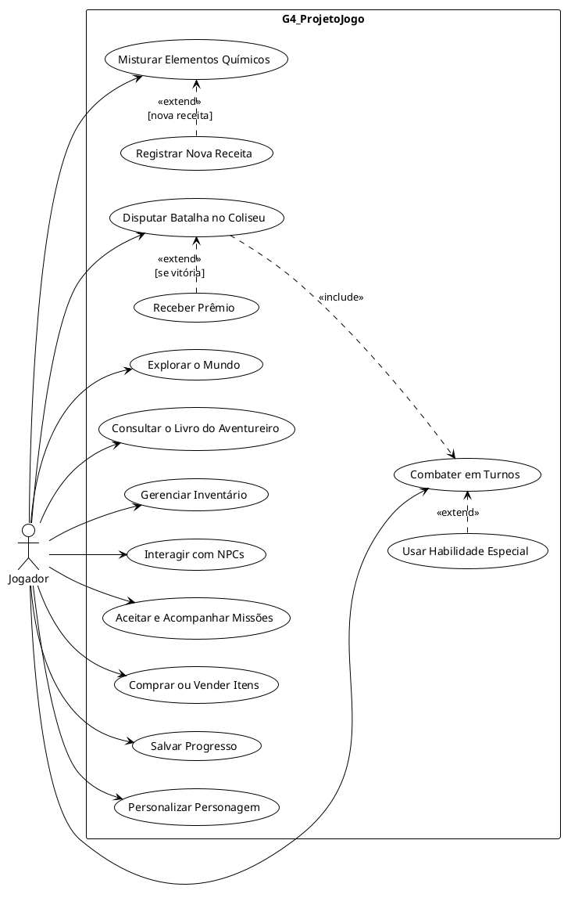

# Iniciativas Extras: Modelagem Organizacional na Notação UML

## Descrição

Iniciativa extra do Grupo 04 no escopo do **Módulo Modelagem**: a **Modelagem Organizacional na notação UML** do **G4_ProjetoJogo**, expressa pelo **Diagrama de Casos de Uso** elaborado pela SubEquipe_02. O artefato descreve as funcionalidades do jogo sob a perspectiva do usuário e complementa a [Modelagem Estática](Relatórios/SubEquipe_02/ModelagemEstatica.md) e a [Modelagem Dinâmica](Relatórios/SubEquipe_02/ModelagemDinamica.md) da subequipe.

## Objetivo

Registrar uma iniciativa além da entrega mínima do módulo, com um recurso adicional da notação UML: o Diagrama de Casos de Uso. Com ele, pretende-se: (i) explicitar os **atores** e as **funcionalidades** do jogo sob a perspectiva do usuário; (ii) **reforçar a rastreabilidade** entre os artefatos, ligando cada caso de uso aos componentes da modelagem estática e às interações da modelagem dinâmica; e (iii) **sintetizar o escopo funcional** do jogo para a apresentação do trabalho.

## Metodologia

A modelagem organizacional conecta o software ao seu contexto de uso ao descrever atores, papéis e interações com o sistema (BOOCH; RUMBAUGH; JACOBSON, 2005). O Diagrama de Casos de Uso foi adotado como iniciativa extra por oferecer uma visão de alto nível centrada no jogador, complementar às visões estrutural e comportamental dos demais artefatos.

A elaboração seguiu quatro etapas:

1. **Identificação do ator**: o único ator modelado é o **Jogador**, que controla o protagonista em todas as interações, conforme a [definição oficial do projeto](../Projeto/Projeto.md);
2. **Derivação dos casos de uso**: os casos foram derivados dos componentes da [Modelagem Estática](Relatórios/SubEquipe_02/ModelagemEstatica.md), das interações da [Modelagem Dinâmica](Relatórios/SubEquipe_02/ModelagemDinamica.md) e das funcionalidades descritas no projeto;
3. **Definição das relações «include» e «extend»**: as dependências entre casos de uso foram ancoradas nas condições de guarda da Modelagem Dinâmica (`[nova receita]` e `[se vitória]`);
4. **Diagramação em PlantUML**: o diagrama foi descrito como código-fonte no [editor online do PlantUML](https://www.plantuml.com/plantuml/uml/), o mesmo recurso usado na versão 1.0 do Diagrama de Componentes, e exportado para PNG, mantendo o artefato versionável no repositório.

Como o PlantUML posiciona os elementos automaticamente, a disposição visual segue o seu algoritmo de layout, mesma limitação registrada na versão 1.0 do Diagrama de Componentes. Como senso crítico, registra-se que o Diagrama de Casos de Uso **não substitui** os modelos estático e dinâmico: sua contribuição está em comunicar a fronteira e o escopo funcional do sistema, servindo de elo entre os demais artefatos.

## Conteúdo

### Atores e Fronteira do Sistema

| Ator | Descrição | Casos de uso associados |
| :--- | :--- | :--- |
| **Jogador** | Controla o protagonista na exploração e no combate; interage com NPCs, lojas e o Coliseu; gerencia itens e receitas; decide quando salvar o progresso. | UC01 a UC13 |

Tabela 1: Atores do Diagrama de Casos de Uso. Fonte: FARIAS, João Victor (2026).

Todos os casos de uso estão na fronteira do sistema (**G4_ProjetoJogo**). Não há ator secundário: persistência e demais serviços são componentes internos do jogo, não entidades externas.

### Modelagem Organizacional: Diagrama de Casos de Uso

Figura 1: Diagrama de Casos de Uso da modelagem organizacional na notação UML. Fonte: FARIAS, João Victor (2026).

### Casos de Uso

Os elos da última coluna são links para as origens de cada caso de uso: os componentes da [Modelagem Estática](Relatórios/SubEquipe_02/ModelagemEstatica.md) e as interações da [Modelagem Dinâmica](Relatórios/SubEquipe_02/ModelagemDinamica.md).

| Nº | Caso de Uso | Descrição | Elos (componentes e interações) |
| :--: | :--- | :--- | :--- |
| UC01 | Explorar o Mundo | Movimenta o protagonista pelo mundo semiaberto; os *colliders* disparam encontros e demais gatilhos. | [Movimentação Livre; Interação e Gatilhos](Relatórios/SubEquipe_02/ModelagemEstatica.md?id=diagrama-de-componentes) |
| UC02 | Combater em Turnos | Enfrenta inimigos em batalhas por turnos, com menu de ações e sincronização de turnos com a IA. | [Motor de Batalha (ATB); IA de Inimigos](Relatórios/SubEquipe_02/ModelagemEstatica.md?id=diagrama-de-componentes) · [Interação 1](Relatórios/SubEquipe_02/ModelagemDinamica.md?id=interação-1-turno-de-combate) |
| UC03 | Usar Habilidade Especial | Extensão de UC02: emprega golpes exclusivos durante o turno de combate. | [Gerenciador de Habilidades Exclusivas](Relatórios/SubEquipe_02/ModelagemEstatica.md?id=diagrama-de-componentes) |
| UC04 | Misturar Elementos Químicos | Combina elementos coletados para criar itens, consumindo reagentes do inventário. | [Mistura de Elementos Químicos; Gerenciador de Inventário](Relatórios/SubEquipe_02/ModelagemEstatica.md?id=diagrama-de-componentes) · [Interação 1](Relatórios/SubEquipe_02/ModelagemDinamica.md?id=interação-1-turno-de-combate) e [Interação 2](Relatórios/SubEquipe_02/ModelagemDinamica.md?id=interação-2-mistura-e-descoberta) |
| UC05 | Registrar Nova Receita | Extensão de UC04: registra no Livro do Aventureiro uma receita inédita obtida na mistura (`[nova receita]`). | [Livro do Aventureiro; SistemaSalvar](Relatórios/SubEquipe_02/ModelagemEstatica.md?id=diagrama-de-componentes) · [Interação 2](Relatórios/SubEquipe_02/ModelagemDinamica.md?id=interação-2-mistura-e-descoberta) |
| UC06 | Consultar o Livro do Aventureiro | Consulta as receitas descobertas e a lore registrada. | [Livro do Aventureiro](Relatórios/SubEquipe_02/ModelagemEstatica.md?id=diagrama-de-componentes) |
| UC07 | Gerenciar Inventário | Organiza e consulta itens e reagentes; base para *crafting*, lojas, Coliseu e batalha. | [Gerenciador de Inventário](Relatórios/SubEquipe_02/ModelagemEstatica.md?id=diagrama-de-componentes) |
| UC08 | Interagir com NPCs | Ativa *colliders* de NPCs e inicia conversas. | [Interação e Gatilhos; Controlador de NPCs](Relatórios/SubEquipe_02/ModelagemEstatica.md?id=diagrama-de-componentes) |
| UC09 | Aceitar e Acompanhar Missões | Inicia *sidequests* oferecidas por NPCs e acompanha o progresso no Jornal de Missões. | [Jornal de Missões; Controlador de NPCs](Relatórios/SubEquipe_02/ModelagemEstatica.md?id=diagrama-de-componentes) |
| UC10 | Comprar ou Vender Itens | Negocia com mercadores; a compra debita ouro e transfere o item ao inventário. | [Lojas (Merchants); Menu de Status; Gerenciador de Inventário](Relatórios/SubEquipe_02/ModelagemEstatica.md?id=diagrama-de-componentes) · [Interação 4](Relatórios/SubEquipe_02/ModelagemDinamica.md?id=interação-4-interação-de-loja) |
| UC11 | Disputar Batalha no Coliseu | Aposta um item e disputa uma batalha com regras de arena próprias. | [O Coliseu; Motor de Batalha (ATB)](Relatórios/SubEquipe_02/ModelagemEstatica.md?id=diagrama-de-componentes) · [Interação 3](Relatórios/SubEquipe_02/ModelagemDinamica.md?id=interação-3-batalha-no-coliseu) |
| UC12 | Salvar Progresso | Persiste status, itens, descobertas e progresso em pontos de salvamento e gatilhos. | [SistemaSalvar](Relatórios/SubEquipe_02/ModelagemEstatica.md?id=diagrama-de-componentes) · [Interação 2](Relatórios/SubEquipe_02/ModelagemDinamica.md?id=interação-2-mistura-e-descoberta) e [Interação 3](Relatórios/SubEquipe_02/ModelagemDinamica.md?id=interação-3-batalha-no-coliseu) |
| UC13 | Personalizar Personagem | Ajusta a aparência e os atributos do protagonista. | [Personalização do Personagem; Menu de Status](Relatórios/SubEquipe_02/ModelagemEstatica.md?id=diagrama-de-componentes) |
| UC14 | Receber Prêmio | Extensão de UC11: recebe o prêmio ao vencer a batalha no Coliseu (`[se vitória]`). | [O Coliseu; Gerenciador de Inventário](Relatórios/SubEquipe_02/ModelagemEstatica.md?id=diagrama-de-componentes) · [Interação 3](Relatórios/SubEquipe_02/ModelagemDinamica.md?id=interação-3-batalha-no-coliseu) |

Tabela 2: Casos de uso do diagrama e seus elos de rastreabilidade. Fonte: FARIAS, João Victor (2026).

### Relações «include» e «extend»

| Origem | Relação | Destino | Condição | Elo |
| :--- | :--: | :--- | :--- | :--- |
| UC03 Usar Habilidade Especial | «extend» | UC02 Combater em Turnos | Quando o jogador opta por um golpe especial no turno. | Invocação de golpes especiais (*[Motor de Batalha](Relatórios/SubEquipe_02/ModelagemEstatica.md?id=diagrama-de-componentes) → [Habilidades Exclusivas](Relatórios/SubEquipe_02/ModelagemEstatica.md?id=diagrama-de-componentes)*) |
| UC05 Registrar Nova Receita | «extend» | UC04 Misturar Elementos Químicos | `[nova receita]`: apenas quando a combinação é inédita. | Guarda `[nova receita]` da [Interação 2](Relatórios/SubEquipe_02/ModelagemDinamica.md?id=interação-2-mistura-e-descoberta) |
| UC11 Disputar Batalha no Coliseu | «include» | UC02 Combater em Turnos | Sem condição: a arena reutiliza o motor de batalha. | Regras de arena (*[Coliseu](Relatórios/SubEquipe_02/ModelagemEstatica.md?id=diagrama-de-componentes) → [Motor de Batalha](Relatórios/SubEquipe_02/ModelagemEstatica.md?id=diagrama-de-componentes)*); [Interação 3](Relatórios/SubEquipe_02/ModelagemDinamica.md?id=interação-3-batalha-no-coliseu) |
| UC14 Receber Prêmio | «extend» | UC11 Disputar Batalha no Coliseu | `[se vitória]`: apenas se o jogador vencer a batalha. | Guarda `[se vitória]` da [Interação 3](Relatórios/SubEquipe_02/ModelagemDinamica.md?id=interação-3-batalha-no-coliseu) |

Tabela 3: Relações «include» e «extend» e suas condições. Fonte: FARIAS, João Victor (2026).

### Código-Fonte do Diagrama

O código PlantUML utilizado para gerar a Figura 1 está abaixo. Para reproduzi-lo, basta colar o conteúdo no [editor online do PlantUML](https://www.plantuml.com/plantuml/uml/).

Clique para expandir o código-fonte (PlantUML)

Código 1: Código-fonte em PlantUML do Diagrama de Casos de Uso. Fonte: FARIAS, João Victor (2026).

### Lista de Requisitos Iniciais

A tabela a seguir reúne os 43 requisitos iniciais elicitados para o G4_ProjetoJogo, usados como inspiração para as modelagens da SubEquipe_02. A coluna final registra quais requisitos de fato foram contemplados nos artefatos modelados (Modelagem Estática, Modelagem Dinâmica e Diagrama de Casos de Uso).

| Nº | Nome (verbo + substantivo) | Requisito (completo) | Usado nas modelagens? |
| :--: | :--- | :--- | :--: |
| 1 | Mover o jogador | Poder mover o jogador nas quatro direções cardeais | Sim |
| 2 | Explorar o mundo semiaberto | Poder explorar livremente as áreas delimitadas do mundo entre os combates | Sim |
| 3 | Consultar o minimapa | Poder consultar um minimapa dinâmico com a posição atual e a topologia da área | Não |
| 4 | Coletar elementos químicos | Poder coletar elementos químicos da tabela periódica espalhados pelo mundo | Sim |
| 5 | Encontrar tesouros | Poder encontrar tesouros durante a exploração | Não |
| 6 | Salvar o progresso | Poder salvar o progresso da partida ao interagir com um savepoint | Sim |
| 7 | Retornar ao savepoint | Poder retornar ao último savepoint registrado após um game over | Sim |
| 8 | Iniciar a batalha | Poder iniciar uma batalha ao encontrar um inimigo durante a exploração | Sim |
| 9 | Definir o tipo de início | Poder iniciar a batalha como normal, preemptiva ou emboscada, informando o jogador | Sim |
| 10 | Preencher a barra de ATB | Poder preencher a barra de ATB de cada combatente em função de seu atributo de velocidade | Sim |
| 11 | Exibir o menu de comandos | Poder exibir o menu de comandos do personagem quando sua barra de ATB completar | Sim |
| 12 | Atacar o inimigo | Poder atacar um inimigo, subtraindo o dano calculado de seu HP | Sim |
| 13 | Usar um item | Poder consumir um item do inventário durante a batalha, removendo uma unidade do estoque | Sim |
| 14 | Fugir da batalha | Poder tentar fugir da batalha, encerrando o combate sem vitória nem game over quando bem-sucedida | Sim |
| 15 | Selecionar o alvo | Poder selecionar o alvo da ação antes de sua execução | Sim |
| 16 | Consumir o custo da ação | Poder debitar do personagem o custo da ação escolhida no momento de sua execução | Sim |
| 17 | Exibir o feedback de dano | Poder exibir o dano causado sobre o alvo de forma visual e numérica | Não |
| 18 | Encerrar a batalha por vitória | Poder encerrar a batalha quando todos os inimigos forem derrotados | Sim |
| 19 | Distribuir as recompensas | Poder distribuir experiência, moeda e loot ao jogador ao final de uma batalha vencida | Sim |
| 20 | Encerrar a batalha por derrota | Poder encerrar a partida em game over quando o HP do jogador chegar a 0 | Sim |
| 21 | Misturar elementos químicos | Poder combinar dois ou mais elementos químicos fora da batalha, consultando a tabela de reações | Sim |
| 22 | Criar um item | Poder produzir um novo item a partir de uma combinação válida, adicionando-o ao inventário | Sim |
| 23 | Tratar a mistura inválida | Poder consumir os elementos sem gerar item quando a combinação for inválida | Sim |
| 24 | Registrar a receita | Poder registrar automaticamente no Livro do Aventureiro cada receita descoberta | Sim |
| 25 | Consultar o Livro do Aventureiro | Poder consultar as receitas já descobertas sem depender de tentativa e erro | Sim |
| 26 | Gerenciar o inventário | Poder visualizar e organizar os itens e elementos químicos que o jogador possui | Sim |
| 27 | Acumular experiência | Poder acumular experiência ao derrotar inimigos e concluir missões | Sim |
| 28 | Upar o personagem | Poder subir de nível ao acumular experiência suficiente, elevando HP, MP e dano | Não |
| 29 | Evoluir a árvore de habilidades | Poder desbloquear novas habilidades em uma árvore de progressão | Não |
| 30 | Personalizar o personagem | Poder alterar a aparência do personagem sem afetar o resultado das batalhas | Sim |
| 31 | Comprar itens do NPC | Poder adquirir itens e elementos químicos com NPCs vendedores | Sim |
| 32 | Melhorar o equipamento | Poder melhorar o equipamento do jogador junto ao Ferreiro da vila | Não |
| 33 | Aceitar uma sidequest | Poder aceitar missões secundárias oferecidas por NPCs quest-givers | Sim |
| 34 | Acompanhar as missões | Poder acompanhar o progresso das missões ativas na tela atual, sem navegar por menus anteriores | Sim |
| 35 | Enfrentar um boss | Poder enfrentar inimigos do tipo boss ao final das etapas da história | Não |
| 36 | Progredir na história linear | Poder progredir pelos eventos principais em sequência fixa até zerar o jogo | Sim |
| 37 | Exibir o HUD de batalha | Poder exibir HP, MP, efeitos de status e o menu de ações durante todo o combate | Sim |
| 38 | Exibir dicas contextuais | Poder exibir dicas contextuais que orientem o jogador sobre objetivos, controles e mecânicas | Não |
| 39 | Mapear os botões | Poder remapear os botões de comando conforme a preferência do jogador | Sim |
| 40 | Confirmar ações irreversíveis | Poder exigir confirmação antes de ações irreversíveis, como vender itens raros | Não |
| 41 | Explicar a falha da ação | Poder informar o motivo de uma ação ter falhado e como corrigi-la | Sim |
| 42 | Gerar encontros procedurais | Poder gerar mapas e encontros proceduralmente para sustentar a rejogabilidade | Não |
| 43 | Viajar rapidamente | Poder deslocar-se rapidamente entre áreas já visitadas | Não |

Tabela 4: Lista de requisitos iniciais do G4_ProjetoJogo, inspiração das modelagens da SubEquipe_02. Fonte: FARIAS, João Victor (2026).

## Referências

BOOCH, Grady; RUMBAUGH, James; JACOBSON, Ivar. **UML: Guia do Usuário**. 2. ed. Rio de Janeiro: Elsevier, 2005.

FOWLER, Martin. **UML Essencial: um breve guia para a linguagem-padrão de modelagem de objetos**. 3. ed. Porto Alegre: Bookman, 2005.

OMG. **Unified Modeling Language Specification, version 2.5.1**. Object Management Group, 2017. Disponível em: <https://www.omg.org/spec/UML/2.5.1/>. Acesso em: 17 set. 2026.

UML-DIAGRAMS.ORG. **UML Use Case Diagrams**. Disponível em: <https://www.uml-diagrams.org/use-case-diagrams.html>. Acesso em: 17 set. 2026.

## Nível de Contribuição dos Integrantes

| Nome | % de Contribuição |
|------|-------------------|
| João Victor da Silva Batista de Farias | 50% |
| João Igor Pereira da Costa | 50% |

Tabela 5: Contribuição dos integrantes.

## Histórico de Versão

| Versão | Data | Descrição | Autor(es) | Revisor |
|:------:|------|:----------|:----------|:--------|
|  1.0   | 17/09 | Adição da iniciativa extra: Modelagem Organizacional na notação UML com o Diagrama de Casos de Uso | [João Victor](https://github.com/beyondmagic) | [João Igor](https://github.com/JoaoPC10) |
|  1.1   | 17/09 | Correção da renderização da imagem no GitHub Pages (troca de `` por sintaxe Markdown) | [João Victor](https://github.com/beyondmagic) |         |
|  1.2   | 17/09 | Adição da lista de requisitos iniciais que inspirou as modelagens | [João Victor](https://github.com/beyondmagic) |         |

Tabela 6: Histórico de versão.

Ver também: [Modelagem Estática (SubEquipe_02)](Relatórios/SubEquipe_02/ModelagemEstatica.md) · [Modelagem Dinâmica (SubEquipe_02)](Relatórios/SubEquipe_02/ModelagemDinamica.md) · [Participações](1.2.ParticipacoesModelagem.md)
