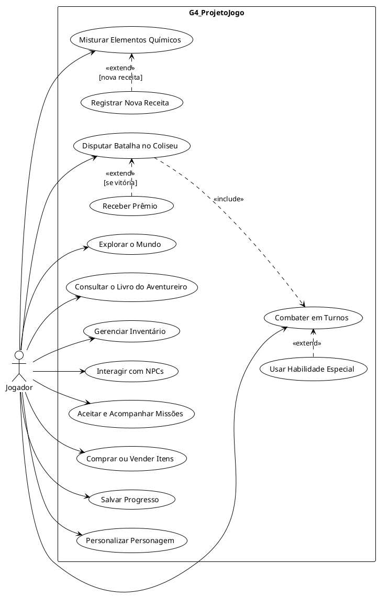

# Iniciativas Extras — Modelagem Organizacional na Notação UML

## Descrição

Iniciativa extra do Grupo 04 no escopo do **Módulo Modelagem**: a **Modelagem Organizacional na notação UML** do **G4_ProjetoJogo**, materializada no **Diagrama de Casos de Uso** e elaborada pela SubEquipe_02. O artefato representa as funcionalidades do jogo sob a perspectiva de quem o utiliza, complementando a [Modelagem Estática](Relatórios/SubEquipe_02/ModelagemEstatica.md) e a [Modelagem Dinâmica](Relatórios/SubEquipe_02/ModelagemDinamica.md) já produzidas pela subequipe.

## Objetivo

Registrar uma iniciativa que vai além da entrega mínima do módulo, exercitando um recurso adicional da notação UML — o Diagrama de Casos de Uso. Com ele, pretende-se: (i) explicitar os **atores** e as **funcionalidades** do jogo sob a perspectiva do usuário; (ii) **reforçar a rastreabilidade** entre os artefatos, ligando cada caso de uso aos componentes da modelagem estática e às interações da modelagem dinâmica; e (iii) apoiar a **comunicação do escopo funcional** do jogo na apresentação do trabalho.

## Metodologia

A modelagem organizacional na UML conecta o software ao contexto em que será utilizado, descrevendo os atores (usuários), seus papéis e as interações que mantêm com o sistema (BOOCH; RUMBAUGH; JACOBSON, 2005). Nesta entrega, o Diagrama de Casos de Uso foi escolhido como iniciativa extra por oferecer uma leitura de alto nível centrada no jogador, complementar às visões estrutural e comportamental já cobertas.

A elaboração seguiu quatro etapas:

1. **Identificação do ator**: a partir da [definição oficial do projeto](../Projeto/Projeto.md), o único ator modelado é o **Jogador**, que controla o protagonista em todas as interações com o jogo;
2. **Derivação dos casos de uso**: os casos foram derivados dos fluxos já modelados — os componentes da [Modelagem Estática](Relatórios/SubEquipe_02/ModelagemEstatica.md) e as interações da [Modelagem Dinâmica](Relatórios/SubEquipe_02/ModelagemDinamica.md) — e das funcionalidades descritas no projeto;
3. **Definição das relações «include» e «extend»**: as dependências entre casos de uso foram ancoradas nas condições de guarda da Modelagem Dinâmica (`[nova receita]` e `[se vitória]`), mantendo os dois modelos consistentes;
4. **Diagramação em PlantUML**: o diagrama foi descrito como código-fonte na plataforma [PlantUML](https://www.plantuml.com/plantuml/uml/) — a mesma utilizada na versão 1.0 do Diagrama de Componentes — e exportado para PNG, o que mantém o artefato versionável junto ao restante do repositório.

Como o PlantUML posiciona os elementos automaticamente, a disposição visual é determinada pelo seu algoritmo de layout — a mesma limitação já registrada na versão 1.0 do Diagrama de Componentes. Como senso crítico, registra-se que o Diagrama de Casos de Uso **não substitui** os modelos estático e dinâmico: seu valor está em comunicar o escopo funcional e a fronteira do sistema, servindo de elo de navegação entre os demais artefatos.

## Conteúdo

### Atores e Fronteira do Sistema

| Ator | Descrição | Casos de uso associados |
| :--- | :--- | :--- |
| **Jogador** | Controla o protagonista durante a exploração e o combate; interage com NPCs, lojas e o Coliseu, gerencia itens e receitas e decide quando salvar o progresso. | UC01 a UC13 |

Tabela 1: Atores do Diagrama de Casos de Uso. Fonte: FARIAS, João Victor (2026).

Todos os casos de uso estão contidos na fronteira do sistema (**G4_ProjetoJogo**). Nenhum ator secundário foi modelado: a persistência e os demais serviços são componentes internos do jogo, e não entidades externas ao sistema.

### Modelagem Organizacional: Diagrama de Casos de Uso

Figura 1: Modelagem Organizacional na notação UML — Diagrama de Casos de Uso. Fonte: FARIAS, João Victor (2026).

### Casos de Uso

Os elos da última coluna fazem referência aos componentes da [Modelagem Estática](Relatórios/SubEquipe_02/ModelagemEstatica.md) e às interações numeradas da [Modelagem Dinâmica](Relatórios/SubEquipe_02/ModelagemDinamica.md).

| Nº | Caso de Uso | Descrição | Elos (componentes e interações) |
| :--: | :--- | :--- | :--- |
| UC01 | Explorar o Mundo | Movimenta o protagonista pelo mundo semiaberto; os *colliders* disparam encontros e demais gatilhos. | Movimentação Livre; Interação e Gatilhos |
| UC02 | Combater em Turnos | Enfrenta inimigos em batalhas por turnos, com menu de ações e sincronização com a IA. | Motor de Batalha (ATB); IA de Inimigos — Interação 1 |
| UC03 | Usar Habilidade Especial | Emprega golpes exclusivos durante o combate (extensão opcional do turno). | Gerenciador de Habilidades Exclusivas |
| UC04 | Misturar Elementos Químicos | Combina elementos coletados para criar itens, consumindo reagentes do inventário. | Mistura de Elementos Químicos; Gerenciador de Inventário — Interações 1 e 2 |
| UC05 | Registrar Nova Receita | Registra no Livro do Aventureiro uma receita inédita obtida na mistura (extensão `[nova receita]`). | Livro do Aventureiro; SistemaSalvar — Interação 2 |
| UC06 | Consultar o Livro do Aventureiro | Consulta as receitas descobertas e a lore registrada. | Livro do Aventureiro |
| UC07 | Gerenciar Inventário | Organiza e consulta itens e reagentes; base para *crafting*, lojas, Coliseu e batalha. | Gerenciador de Inventário |
| UC08 | Interagir com NPCs | Ativa *colliders* de NPCs e inicia conversas. | Interação e Gatilhos; Controlador de NPCs |
| UC09 | Aceitar e Acompanhar Missões | Inicia *sidequests* oferecidas por NPCs e acompanha o progresso no Jornal de Missões. | Jornal de Missões; Controlador de NPCs |
| UC10 | Comprar ou Vender Itens | Negocia com mercadores; a compra debita ouro e transfere o item ao inventário. | Lojas (Merchants); Menu de Status; Gerenciador de Inventário — Interação 4 |
| UC11 | Disputar Batalha no Coliseu | Aposta um item e disputa uma batalha com regras de arena próprias. | O Coliseu; Motor de Batalha (ATB) — Interação 3 |
| UC12 | Salvar Progresso | Persiste status, itens, descobertas e progresso nos pontos de salvamento e gatilhos. | SistemaSalvar — Interações 2 e 3 |
| UC13 | Personalizar Personagem | Ajusta a aparência e os atributos iniciais do protagonista. | Personalização do Personagem; Menu de Status |
| UC14 | Receber Prêmio | Extensão de UC11: recebe o prêmio quando vence a batalha no Coliseu (`[se vitória]`). | O Coliseu; Gerenciador de Inventário — Interação 3 |

Tabela 2: Casos de uso do diagrama e seus elos de rastreabilidade. Fonte: FARIAS, João Victor (2026).

### Relações «include» e «extend»

| Origem | Relação | Destino | Condição | Elo |
| :--- | :--: | :--- | :--- | :--- |
| UC03 Usar Habilidade Especial | «extend» | UC02 Combater em Turnos | Quando o jogador opta por um golpe especial no turno. | Invocação de golpes especiais (*Motor de Batalha → Habilidades Exclusivas*) |
| UC05 Registrar Nova Receita | «extend» | UC04 Misturar Elementos Químicos | `[nova receita]` — apenas quando a combinação é inédita. | Guarda `[nova receita]` da Interação 2 |
| UC11 Disputar Batalha no Coliseu | «include» | UC02 Combater em Turnos | Sempre — a arena reutiliza o motor de batalha. | Regras de arena (*Coliseu → Motor de Batalha*); Interação 3 |
| UC14 Receber Prêmio | «extend» | UC11 Disputar Batalha no Coliseu | `[se vitória]` — apenas se o jogador vencer a batalha. | Guarda `[se vitória]` da Interação 3 |

Tabela 3: Relações «include» e «extend» e suas condições. Fonte: FARIAS, João Victor (2026).

### Código-Fonte do Diagrama

Abaixo encontra-se o código em linguagem PlantUML utilizado para gerar a imagem da Figura 1. Para reproduzi-lo, basta colar o conteúdo no [editor online do PlantUML](https://www.plantuml.com/plantuml/uml/).

Clique para expandir o código-fonte (PlantUML)

Código 1: Código-fonte em PlantUML do Diagrama de Casos de Uso. Fonte: FARIAS, João Victor (2026).

## Referências

BOOCH, Grady; RUMBAUGH, James; JACOBSON, Ivar. **UML: Guia do Usuário**. 2. ed. Rio de Janeiro: Elsevier, 2005.

FOWLER, Martin. **UML Essencial: um breve guia para a linguagem-padrão de modelagem de objetos**. 3. ed. Porto Alegre: Bookman, 2005.

OMG. **Unified Modeling Language Specification, version 2.5.1**. Object Management Group, 2017. Disponível em: <https://www.omg.org/spec/UML/2.5.1/>. Acesso em: 17 set. 2026.

UML-DIAGRAMS.ORG. **UML Use Case Diagrams**. Disponível em: <https://www.uml-diagrams.org/use-case-diagrams.html>. Acesso em: 17 set. 2026.

## Nível de Contribuição dos Integrantes

| Nome | % de Contribuição |
|------|-------------------|
| João Victor da Silva Batista de Farias | 100% |

Tabela 4: Contribuição dos integrantes.

## Histórico de Versão

| Versão | Data | Descrição | Autor(es) | Revisor |
|:------:|------|:----------|:----------|:--------|
|  1.0   | 17/09 | Adição da iniciativa extra: Modelagem Organizacional na notação UML com o Diagrama de Casos de Uso | [João Victor](https://github.com/beyondmagic) | [João Igor](https://github.com/JoaoPC10) |

Tabela 5: Histórico de versão.

Ver também: [Modelagem Estática (SubEquipe_02)](Relatórios/SubEquipe_02/ModelagemEstatica.md) · [Modelagem Dinâmica (SubEquipe_02)](Relatórios/SubEquipe_02/ModelagemDinamica.md) · [Participações](1.2.ParticipacoesModelagem.md)
