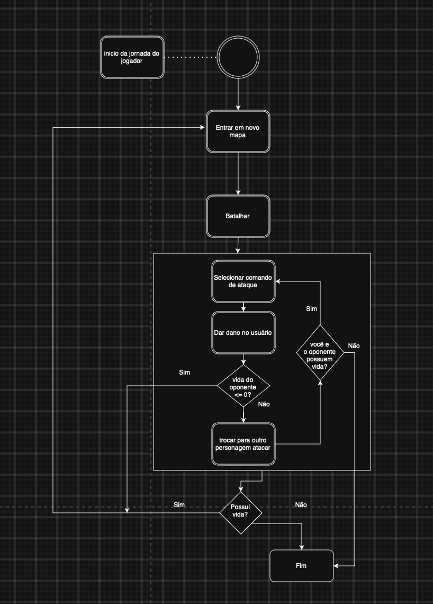

# SubEquipe_01 — Modelagem Dinâmica na Notação UML

## Descrição

Modelagem de processo de negócio da SubEquipe_01, no escopo do **FOCO_02 — Modelagem Dinâmica na Notação UML**. Representa, na notação UML, a modelagem dinâmica do software.

## Objetivo

Elaborar em UML uma modelagem dinâmica pela subequipe, evidenciando as atividades, os eventos e os pontos de decisão do processo.

## Metodologia

A modelagem dinâmica representa o comportamento do sistema ao longo do tempo, evidenciando estados, eventos, transições e pontos de decisão (OBJECT MANAGEMENT GROUP, 2017). Cada integrante da subequipe descreve, nesta seção, o diagrama sob sua responsabilidade.

### Diagrama de Estados

Diagrama de estados do fluxo de batalhas do sistema G4_ProjetoJogo, representando as transições percorridas pelo jogador ao ingressar em novos mapas e enfrentar batalhas.

O diagrama parte de um pseudoestado inicial, disparado pelo evento "início da jornada do jogador", que leva ao estado `Entrar em novo mapa`. Desse estado, o jogador transita para `Batalhar`, que contém um estado composto com o ciclo interno entre `Dar dano` e `Receber dano`, representando as trocas de ataque durante o combate. Ao final do combate, uma transição guiada pela condição `Possui vida?` decide o próximo estado: em caso positivo (`Sim`), o fluxo retorna a `Entrar em novo mapa`, reiniciando o ciclo de progressão pelos mapas; em caso negativo (`Não`), o fluxo segue para o estado final `Fim`. A notação segue os elementos de diagrama de estados definidos pela UML — pseudoestado inicial, estado composto, transições guardadas e estado final. O diagrama foi feito com apoio do material do módulo de Modelagem disponibilizado no [site da disciplina](https://sites.google.com/view/unb-fcte-arqdsw/módulos/módulo-modelagem?authuser=0).

## Conteúdo

### Modelagem Dinâmica

#### Diagrama de Estados

O diagrama de estados descreve o ciclo de progressão do jogador pelos mapas do sistema G4_ProjetoJogo, alternando entre a entrada em um novo mapa, a batalha contra os inimigos presentes nele e a decisão sobre a continuidade da jornada, conforme a sua condição de vida.

Figura 1: Diagrama de estados do fluxo de batalhas. Fonte: Elaboração própria, 2026.

O estado composto `Batalhar` concentra o comportamento repetitivo do combate: os estados internos `Dar dano` e `Receber dano` alternam-se enquanto a batalha ocorre, sem que essa alternância seja detalhada no nível dos demais estados do fluxo. Ao sair do estado composto, a transição guardada pela condição `Possui vida?` determina se o jogador segue para um novo mapa (`Sim`) ou se o fluxo é encerrado no estado final `Fim` (`Não`), encerrando a jornada.

## Referências

OBJECT MANAGEMENT GROUP. **OMG Unified Modeling Language (OMG UML), Version 2.5.1**. 2017. Disponível em: <https://www.omg.org/spec/UML/2.5.1/PDF>. Acesso em: 12 set. 2026.

UNB FCTE — ARQDSW. **Módulo de Modelagem**. Disponível em: <https://sites.google.com/view/unb-fcte-arqdsw/módulos/módulo-modelagem?authuser=0>. Acesso em: 12 set. 2026.

## Nível de Contribuição dos Integrantes

| Nome | % de Contribuição |
|------|-------------------|
|  Gabriel Andrade Magioli    |         33%         |

Tabela 1: Contribuição dos integrantes.

## Histórico de Versão

| Versão | Data | Descrição | Autor(es) | Revisor |
|:------:|------|:----------|:----------|:--------|
|    1.0    |   12/09/2026   |     Incluir diagrama de estados      |     Gabriel Andrade Magioli     |         |

Tabela 2: Histórico de versão.

