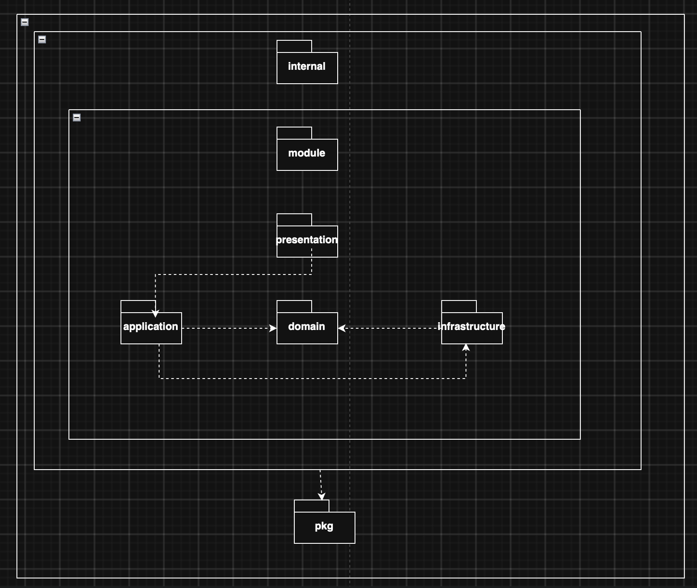
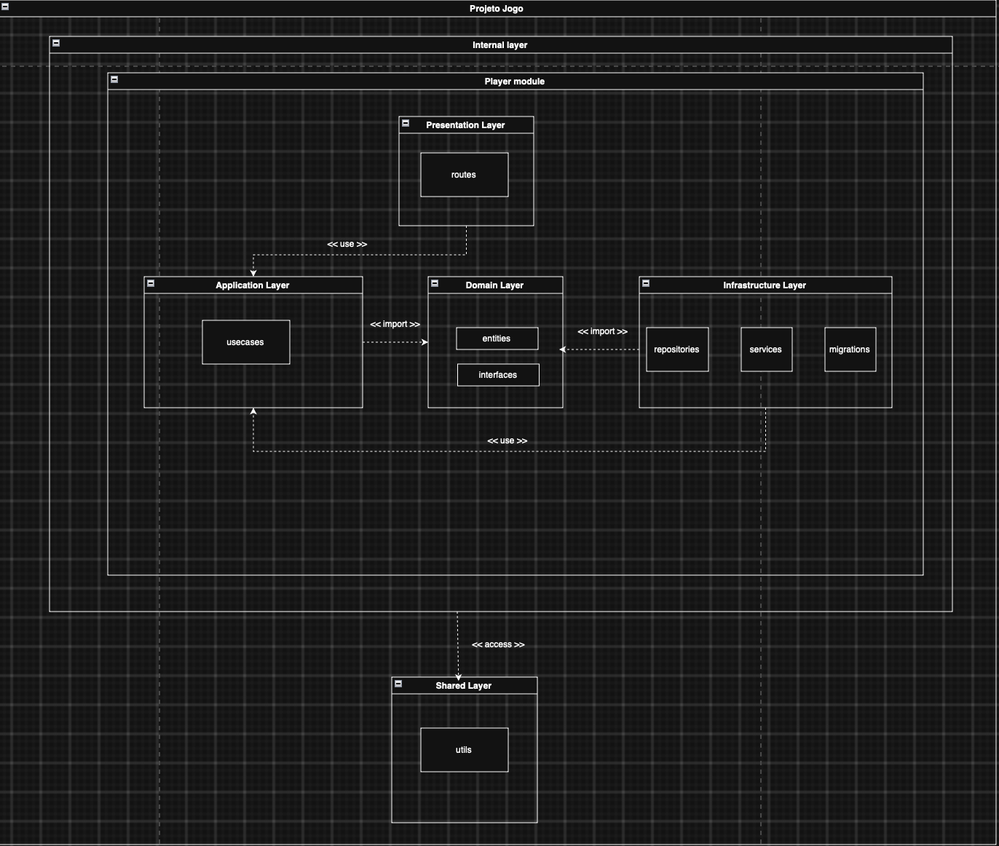

# SubEquipe_01: Diagrama de Pacotes

## Descrição

Diagrama de pacotes do módulo de jogador do **G4_ProjetoJogo**, elaborado pela SubEquipe_01 no escopo do **FOCO_01: Modelagem Estática na Notação UML**.

## Objetivo

Representar em UML a organização dos pacotes do módulo de jogador e suas dependências, permitindo compreender a divisão estrutural desse módulo.

## Metodologia

O diagrama de pacotes documenta a organização estrutural do módulo de jogador, evidenciando como seus pacotes se agrupam e se relacionam por dependências ([OBJECT MANAGEMENT GROUP, 2017][uml]).

O diagrama foi estruturado seguindo os princípios de **Domain-Driven Design (DDD)** combinados com uma **arquitetura hexagonal (ports and adapters)**: o domínio (`domain`), com suas entidades e interfaces, ocupa o centro da arquitetura e não depende de nenhuma outra camada; a aplicação (`application`) orquestra os casos de uso a partir do domínio; e a infraestrutura (`infrastructure`) implementa, como adaptadores, as interfaces definidas pelo domínio, mantendo a direção das dependências sempre voltada para dentro. Como referência para confecção do diagrama, foi usado como base o [tutorial de diagrama de pacotes da Lucid][lucid] (LUCID SOFTWARE INC., 2026) e o [material do módulo de Modelagem][disciplina] disponibilizado na disciplina de Arquitetura e Desenho de Software (UNB FCTE: ARQDSW, 2026), e os conceitos de DDD e arquitetura hexagonal para a organização das camadas e das dependências entre os pacotes foi baseado em experiências prévias em projetos.

Há duas versões do diagrama: uma visão geral, com os pacotes principais e suas dependências (Figura 1), e uma visão detalhada, evidenciando os subpacotes internos de cada camada e os estereótipos de dependência `<<use>>`, `<<import>>` e `<<access>>`, conforme a notação definida pela UML (Figura 2).

## Conteúdo

### Diagrama de Pacotes

O diagrama de pacotes representa a organização modular do sistema G4_ProjetoJogo, com foco no módulo interno do jogador (*Player module*). O pacote `internal` isola a camada interna do jogo do restante do código-fonte, enquanto o pacote `pkg` reúne elementos de uso compartilhado, acessados pelas demais camadas.

Figura 1: Diagrama de pacotes do módulo de jogador: visão geral. Fonte: Elaboração própria, 2026.

Dentro do módulo do jogador, adotei uma organização em camadas inspirada em DDD e arquitetura hexagonal: a camada de apresentação (`presentation`) depende da camada de aplicação (`application`), que por sua vez importa (`<<import>>`) a camada de domínio (`domain`); a camada de infraestrutura (`infrastructure`) também importa o domínio e, ao mesmo tempo, é utilizada (`<<use>>`) pela camada de aplicação. Nessa disposição, o domínio funciona como o núcleo hexagonal da arquitetura, definindo as regras de negócio e as interfaces (portas) que a infraestrutura implementa como adaptadores, sem que o domínio dependa de detalhes de implementação.

A versão detalhada do diagrama (Figura 2) desdobra cada camada em seus subpacotes: `routes`, na camada de apresentação; `usecases`, na camada de aplicação; `entities` e `interfaces`, na camada de domínio; e `repositories`, `services` e `migrations`, na camada de infraestrutura. A camada compartilhada (*Shared Layer*), com o subpacote `utils`, é acessada (`<<access>>`) pelo módulo do jogador, mas não integra diretamente nenhuma das quatro camadas principais, preservando seu caráter transversal.

Figura 2: Diagrama de pacotes do módulo de jogador: visão detalhada. Fonte: Elaboração própria, 2026.

### Relação com outros diagramas

O [Diagrama de Classes](DiagramaClasses.md#classes-e-justificativa) apresenta entidades como `Jogador` e `Inventario`, relacionadas à responsabilidade do pacote `entities`. Já a coordenação das ações do [Diagrama de Atividades](DiagramaAtividades.md) ajuda a compreender o papel de `usecases`. Essas relações orientam a organização do módulo, mas as figuras não distribuem individualmente as classes ou ações pelos pacotes.

O [Diagrama de Componentes](DiagramaComponentes.md) agrupa serviços por mecânica, enquanto este artefato organiza o módulo do jogador por camadas. Os subsistemas não correspondem diretamente a pacotes: um serviço pode envolver mais de uma camada, e o recorte de componentes abrange outras partes do jogo além desse módulo.

## Referências

LUCID SOFTWARE INC. **Tutorial de diagrama UML de pacotes**. [Tutorial][lucid]. Acesso em: 12 set. 2026.

OBJECT MANAGEMENT GROUP. **OMG Unified Modeling Language (OMG UML), Version 2.5.1**. 2017. [Especificação][uml]. Acesso em: 12 set. 2026.

UNB FCTE: ARQDSW. **Módulo de Modelagem**. [Material da disciplina][disciplina]. Acesso em: 12 set. 2026.

## Nível de Contribuição dos Integrantes

| Nome | % de Contribuição |
|------|-------------------|
|  Gabriel Andrade Magioli    |       100%            |

Tabela 1: Contribuição dos integrantes.

## Histórico de Versão

| Versão | Data | Descrição | Autor(es) | Revisor |
|:------:|------|:----------|:----------|:--------|
|    1.0    |   12/09/2026   |     Incluir diagrama de pacotes      |     Gabriel Andrade Magioli     |        Yogi Nam de Souza Barbosa |
| 1.1 | 18/09/2026 | Adequação do título, descrição, objetivo e seções à página específica do diagrama de pacotes. | Yogi Nam de Souza Barbosa |  |

Tabela 2: Histórico de versão.

[lucid]: https://lucid.co/pt/diagrama/uml/tutorial-de-diagrama-de-pacotes
[uml]: https://www.omg.org/spec/UML/2.5.1/PDF
[disciplina]: https://sites.google.com/view/unb-fcte-arqdsw/módulos/módulo-modelagem?authuser=0
