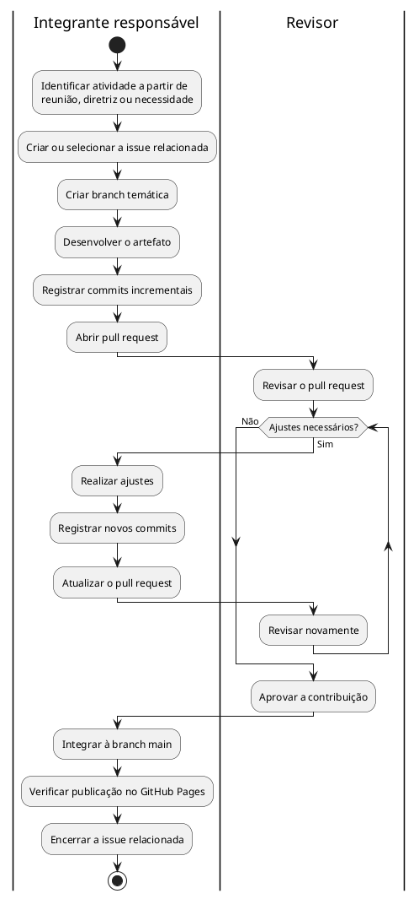

# Metodologia de Trabalho no GitHub

## Descrição

Esta página documenta como o Grupo 04 utilizou os recursos do GitHub para organizar, desenvolver, revisar e rastrear as atividades da Entrega 02.

## Objetivo

Registrar o processo de trabalho adotado na entrega e manter uma cadeia de rastreabilidade entre decisões, tarefas, alterações realizadas, revisões e artefatos publicados.

## Metodologia

A organização da Entrega 02 foi realizada a partir das reuniões da equipe, das diretrizes da disciplina e das necessidades identificadas durante a elaboração dos artefatos. As atividades relevantes foram registradas em **issues**, que concentraram a descrição das tarefas, os responsáveis e, quando aplicável, os critérios de aceitação.

Diferentemente da Entrega 01, **não foi utilizado um quadro Kanban nesta entrega**. O acompanhamento do trabalho ocorreu diretamente pelas issues, branches, commits e pull requests do repositório.

Para o versionamento, foi adotado um fluxo inspirado no **GitHub Flow**: as alterações eram desenvolvidas em branches próprias, registradas por commits e submetidas à branch `main` por meio de pull requests. Os pull requests permitiram revisar as contribuições antes da integração e preservar o histórico das discussões e alterações realizadas.

### Fluxo de Trabalho

O fluxo adotado é representado pelo Diagrama de Atividades UML a seguir.

Figura 1: Diagrama de Atividades UML do fluxo de trabalho adotado pelo Grupo 04. Fonte: Yogi Nam de Souza Barbosa, 2026.

| Etapa        | Recurso                 | Finalidade                                          |
| ------------ | ----------------------- | --------------------------------------------------- |
| Planejamento | Reuniões, atas e issues | Identificar e registrar as atividades necessárias   |
| Execução     | Branches e commits      | Desenvolver os artefatos e preservar sua evolução   |
| Revisão      | Pull requests           | Revisar alterações e registrar discussões e ajustes |
| Integração   | Branch `main`           | Consolidar as contribuições aprovadas               |
| Publicação   | GitHub Pages            | Disponibilizar a documentação resultante            |

Tabela 1: Aplicação dos recursos do GitHub no processo de trabalho.

## Rastreabilidade

A rastreabilidade foi mantida relacionando os registros produzidos ao longo do trabalho. Uma decisão ou necessidade podia originar uma issue; sua implementação era registrada em uma branch e em commits; e o resultado era submetido a revisão por pull request antes de ser integrado e publicado.

| Etapa        | Registro                                                       | Informação preservada                            |
| ------------ | -------------------------------------------------------------- | ------------------------------------------------ |
| Decisão      | Ata                                                            | Contexto e decisões da equipe                    |
| Planejamento | Issue                                                          | Atividade, responsáveis e critérios de aceitação |
| Execução     | Branch e commits                                               | Evolução do artefato e autoria das alterações    |
| Revisão      | Pull request                                                   | Discussões, ajustes, aprovação e integração      |
| Resultado    | Artefato publicado                                             | Versão integrada disponibilizada na documentação |
| Participação | [Quadro de Participações](/Base/1.2.ParticipacoesModelagem.md) | Consolidação das contribuições individuais       |

Tabela 2: Cadeia de rastreabilidade adotada pelo Grupo 04.

Como exemplos dessa relação, as issues de [Diagrama de Componentes](https://github.com/UnBArqDsw2026-2-Turma01/2026.2-T01-G4_ProjetoJogo_Entrega_02/issues/5) e [Diagrama de Atividades](https://github.com/UnBArqDsw2026-2-Turma01/2026.2-T01-G4_ProjetoJogo_Entrega_02/issues/6) foram relacionadas ao [pull request de integração dos dois diagramas](https://github.com/UnBArqDsw2026-2-Turma01/2026.2-T01-G4_ProjetoJogo_Entrega_02/pull/10). Da mesma forma, os diagramas de [Pacotes](https://github.com/UnBArqDsw2026-2-Turma01/2026.2-T01-G4_ProjetoJogo_Entrega_02/issues/3) e [Estados](https://github.com/UnBArqDsw2026-2-Turma01/2026.2-T01-G4_ProjetoJogo_Entrega_02/issues/4) foram incorporados pelo [pull request correspondente](https://github.com/UnBArqDsw2026-2-Turma01/2026.2-T01-G4_ProjetoJogo_Entrega_02/pull/2).

## Evidências de Aplicação

Os indicadores abaixo são consultados automaticamente na API do GitHub e representam o estado corrente do repositório. Como o repositório não é alterado após o encerramento da entrega, esses valores passam a representar o estado final da Entrega 02 após seu fechamento.

| Evidência           | Estado do repositório                             |
| ------------------- | ------------------------------------------------- |
| Issues              | Carregando...         |
| Pull requests       | Carregando...            |
| Fluxo de integração | Branch temática → commits → pull request → `main` |
| Publicação          | Documentação disponibilizada por GitHub Pages     |

Tabela 3: Evidências da aplicação da metodologia. Fonte: GitHub API e histórico do repositório do Grupo 04, 2026.

## Definição de Pronto

Uma atividade era considerada concluída quando:

* atendia ao objetivo e aos critérios de aceitação definidos na issue, quando existentes;
* possuía os arquivos e as evidências necessárias versionados no repositório;
* apresentava links, mídias, legendas e referências funcionando corretamente;
* atualizava a participação dos responsáveis, quando aplicável;
* passava pelo processo de revisão definido pela equipe;
* era integrada à branch `main` e disponibilizada na documentação.

## Avaliação Crítica

O uso de issues, branches, commits e pull requests permitiu preservar a relação entre planejamento, execução, revisão e resultado, além de facilitar a identificação das contribuições individuais.

Nesta entrega, a equipe optou por não utilizar um quadro Kanban. Isso reduziu a quantidade de mecanismos de acompanhamento a manter, concentrando o processo no próprio repositório. Por outro lado, a ausência de uma visão agregada do estado das tarefas tornou mais importante manter as issues e os pull requests atualizados durante a execução.

Como melhoria para os próximos ciclos, recomenda-se criar as issues antes do início das atividades, relacionar explicitamente cada pull request às respectivas issues e manter critérios de aceitação claros para facilitar a revisão e o encerramento das tarefas.

## Referências

GITHUB. **GitHub flow**. GitHub Docs. Disponível em: https://docs.github.com/en/get-started/using-github/github-flow. Acesso em: 17 set. 2026.

GITHUB. **Planning and tracking work for your team or project**. GitHub Docs. Disponível em: https://docs.github.com/en/issues/tracking-your-work-with-issues/learning-about-issues/planning-and-tracking-work-for-your-team-or-project. Acesso em: 17 set. 2026.

OBJECT MANAGEMENT GROUP. **OMG Unified Modeling Language (OMG UML), Version 2.5.1**. 2017. Disponível em: https://www.omg.org/spec/UML/2.5.1/PDF. Acesso em: 17 set. 2026.

PLANTUML. **Activity Diagram (New Syntax)**. Disponível em: https://plantuml.com/activity-diagram-beta. Acesso em: 17 set. 2026.

## Nível de Contribuição dos Integrantes

| Nome                      | % de Contribuição |
| ------------------------- | ----------------: |
| Yogi Nam de Souza Barbosa |              100% |

Tabela 4: Contribuição na elaboração desta página.

## Histórico de Versão

| Versão |    Data    | Descrição                                             | Autor(es)                 | Revisor |
| :----: | :--------: | ----------------------------------------------------- | ------------------------- | ------- |
|   1.0  | 17/09/2026 | Documentação da metodologia de trabalho da Entrega 02 | Yogi Nam de Souza Barbosa |         |

Tabela 5: Histórico de versão.

