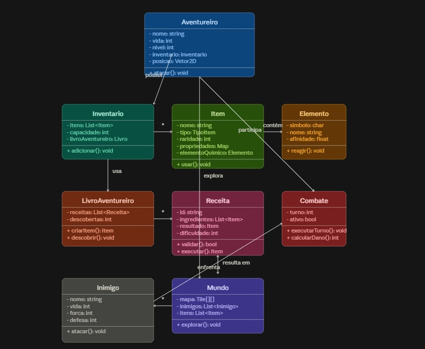
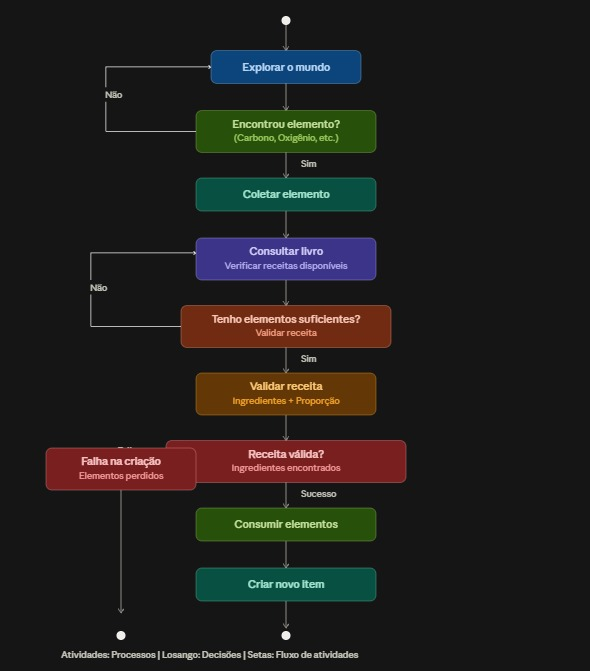
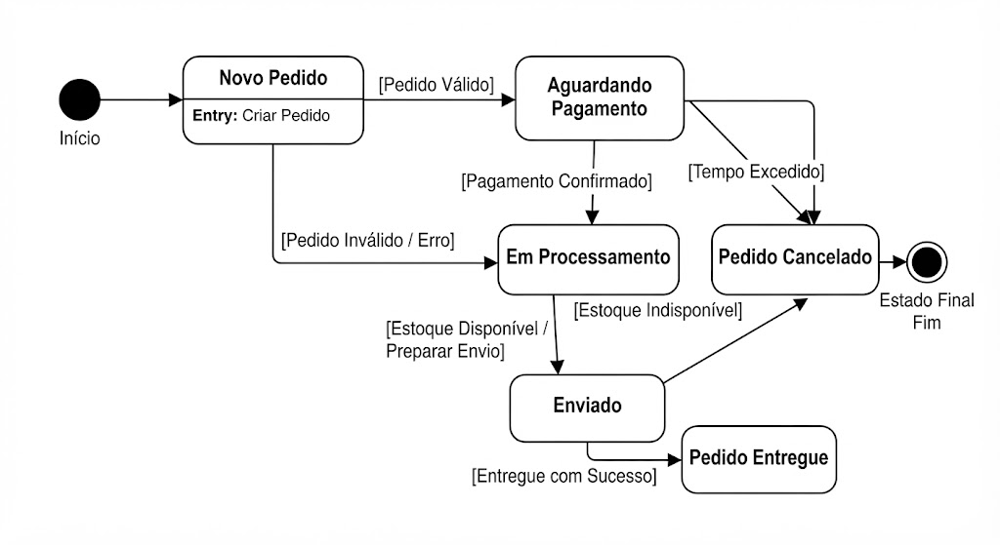
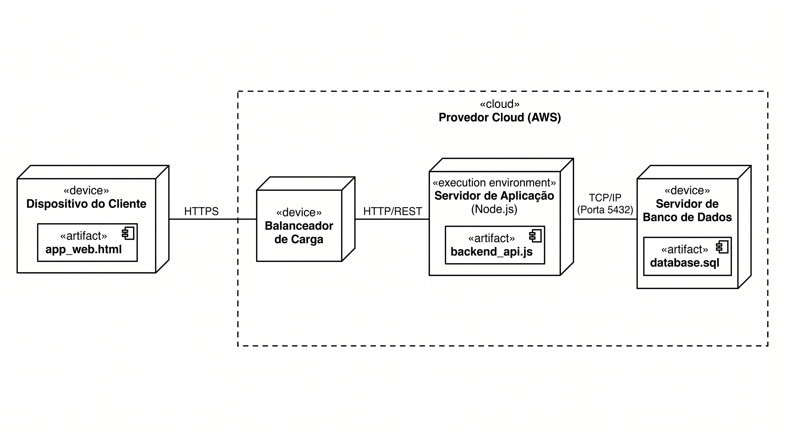

# SubEquipe_02 — IA Generativa

## Descrição

Registro do **FOCO_03 — IA Generativa** da SubEquipe_02. Reúne os pontos de vista de cada integrante sobre as lições aprendidas e o uso de IA Generativa na entrega.

## Objetivo

Registrar, com senso crítico, como cada membro utilizou IA Generativa no trabalho e quais lições foram aprendidas no processo. **TODOS DEVEM PARTICIPAR.**

## Metodologia

Cada integrante registrou, em uma subseção própria, as lições aprendidas e uma análise crítica do uso da IA Generativa, acompanhada de evidências: os diagramas gerados pela ferramenta ou os históricos das conversas.

A IA Generativa foi empregada em dois momentos da entrega: no **estudo das técnicas de modelagem UML**, como apoio à compreensão dos diagramas, e na **priorização dos elementos a serem diagramados**. Em ambos os casos, as saídas foram comparadas com a literatura especializada antes de qualquer uso, e os diagramas finais foram elaborados pelos próprios integrantes.

## Conteúdo

### João Igor

#### Lições Aprendidas
O uso da IA Generativa facilita a análise e a reavaliação de escolhas dentro de um projeto. Na programação de um jogo, por exemplo, tudo é considerado um objeto, desde o personagem principal e os itens até as próprias funções do sistema. Com a ajuda da IA, o escopo do projeto passou por um filtro, focando nas informações mais relevantes. Isso permitiu priorizar os elementos que realmente precisavam ser diagramados, excluindo objetos secundários, como os de cenário. 

#### Uso da IA Generativa (senso crítico)
Para fins de estudo, questionou-se ao Claude.ai se ele conseguiria priorizar os objetos do projeto que deveriam ser diagramados. Além de realizar essa priorização, a ferramenta gerou espontaneamente o Diagrama de Classes apresentado abaixo:

Por mais que tenha acertado, em sua maioria, as classes, observa-se a necessidade de maior rigor técnico no diagrama gerado, o qual exibe falhas estruturais e de notação. Entre os problemas identificados, destacam-se a ausência de distinção entre as setas, a associação incoerente de funções às classes, nomenclaturas errôneas para os tipos de dados e a rotulagem dispensável de ações em determinadas conexões. Soma-se a isso o apelo visual excessivo devido ao uso inadequado de cores e ao cruzamento de linhas sobre o diagrama, comprometendo a sua inteligibilidade. 

A mesma coisa se vê no Diagrama de Atividades, porém aqui os erros foram bem mais críticos:

Note-se a ausência de diferenciação entre os círculos de início e fim do fluxo, além de elementos isolados e da falta de losangos nas bifurcações de decisão. A leitura do diagrama é prejudicada por termos ambíguos e pela ausência de notas explicativas.

### Marcos Vinícius

#### Lições Aprendidas

A IA Generativa foi usada para consolidar conceitos da notação UML que não ficaram claros apenas com os slides da disciplina e a documentação de referência. O foco foi o **Diagrama de Componentes** e a relação entre os **Diagramas de Colaboração e de Comunicação**. Os principais aprendizados foram:

- O Diagrama de Componentes se lê pela relação *"quem requer versus quem oferece"*, representada pelo encaixe *ball-and-socket*: a **interface oferecida** (círculo completo) indica quem realiza o serviço e a **interface requerida** (semicírculo) indica quem depende dele.
- As **portas** (*ports*) são os pontos de entrada e saída de um subsistema, e os **conectores de delegação** repassam a requisição recebida na porta para o subcomponente interno responsável, evitando o cruzamento excessivo de linhas.
- Os **Diagramas de Colaboração e de Comunicação são o mesmo diagrama**: o nome mudou na UML 2.0 pela OMG. Por não terem linha do tempo vertical, expressam a ordem dos eventos pela numeração hierárquica das mensagens (ex.: `1: solicitarPedido()`, `1.1: verificarEstoque()`).
- O **PlantUML não suporta o Diagrama de Comunicação**, o que motivou a escolha do **Draw.io** para esse artefato. Para o Diagrama de Componentes, o soquete exige a sintaxe `-(`, e não a seta de dependência genérica `..>`.

#### Uso da IA Generativa (senso crítico)

O modelo utilizado foi o **Gemini 3.1 Pro Estendido**, do Google. A IA não foi usada para gerar os diagramas prontos, e sim como **tutor**: as perguntas partiram de material já lido e pediram explicações incrementais ancoradas no domínio do próprio projeto, um jogo de RPG. Os históricos completos estão na Tabela 2.

| Conversa | Documento | Link |
|----------|-----------|------|
| Entendendo Diagrama de Componentes UML | [marcos_entendendo_diagrama_de_componentes_uml.pdf](https://github.com/UnBArqDsw2026-2-Turma01/2026.2-T01-G4_ProjetoJogo_Entrega_02/blob/main/docs/Assets/marcos_entendendo_diagrama_de_componentes_uml.pdf) | <https://share.gemini.google/N2FwggRE4M79> |
| UML: Colaboração vs Comunicação | [marcos_uml_colaboracao_vs_comunicacao.pdf](https://github.com/UnBArqDsw2026-2-Turma01/2026.2-T01-G4_ProjetoJogo_Entrega_02/blob/main/docs/Assets/marcos_uml_colaboracao_vs_comunicacao.pdf) | <https://share.gemini.google/jtVsdOLRhqKV> |

Tabela 2: Históricos de conversa com a IA Generativa utilizados por Marcos Vinícius.

**Vantagens observadas**

- **Explicação iterativa:** foi possível reformular a pergunta sobre o mesmo tópico até a dúvida ser sanada, algo que um material estático não oferece.
- **Diagnóstico ferramental:** ao relatar que o soquete não era renderizado, o modelo identificou a causa correta (`..>` em vez de `-(`) e devolveu o código corrigido.
- **Triagem de ferramentas:** a limitação do PlantUML foi confirmada rapidamente, evitando esforço em uma ferramenta inadequada para o artefato.

**Desvantagens observadas**

- **Necessidade de verificação:** as respostas foram tratadas como hipóteses. Afirmações centrais, como a equivalência entre os Diagramas de Colaboração e Comunicação, só entraram no relatório após conferência na literatura.
- **Saídas fora da notação:** o primeiro código PlantUML desenhava uma seta de dependência genérica no lugar do soquete. A falha só foi percebida porque havia conhecimento prévio da notação correta, o que mostra o risco de aceitar respostas plausíveis mas incorretas.
- **Sugestões que contornam o rigor da notação:** a "gambiarra" proposta para simular um Diagrama de Comunicação no PlantUML produziria um artefato fora do padrão UML.
- **Risco de dependência:** as respostas são longas e didáticas, o que pode induzir à leitura passiva. Por isso a IA ficou restrita ao apoio à compreensão, e **a autoria dos diagramas permaneceu integralmente humana**.

**Conclusão:** a IA se mostrou mais valiosa como tutor do que como geradora de artefatos. Nas explicações conceituais o retorno foi consistente; nas saídas técnicas houve erro que exigiu correção. O uso produtivo depende de o usuário já ter repertório suficiente para verificar a resposta recebida.

### Marcelo de Araújo Lopes

#### Lições Aprendidas

O uso da IA Generativa se concentrou em dois pontos. O primeiro foi a organização geral do repositório e dos arquivos `.md`, com a padronização das seções, das tabelas e da numeração das figuras. O segundo foi o apoio ao entendimento do conteúdo em si, principalmente da notação dos Diagramas de Estados e do Diagrama de Implantação, que foram os artefatos sob minha responsabilidade. Em nenhum dos casos a IA substituiu a decisão de modelagem, que foi sempre conferida na especificação da UML e nos artefatos da Entrega 01.

#### Uso da IA Generativa (senso crítico)

Para entender os conceitos por trás do Diagrama de Estados e do Diagrama de Implantação, pedi à IA exemplos em domínios simples. Ela gerou as figuras abaixo e foi explicando cada elemento delas, e foi assim que fui compreendendo como cada parte da notação funciona.

Figura 1: Ciclo de vida de um pedido de compra, usado como exemplo de estudo da notação de máquina de estados. Fonte: Marcelo (2026).

No ciclo de vida de um pedido, a IA explicou o papel de cada elemento: o círculo preenchido que marca o início, a atividade `entry` que roda ao entrar em um estado, as condições entre colchetes que decidem qual caminho seguir e o estado final que encerra o fluxo. Entendi ali que um estado representa uma situação em que o sistema permanece, e que a transição só acontece quando a condição é satisfeita. Foi esse entendimento que me permitiu montar a máquina de estados da partida e a da batalha.

Figura 2: Diagrama de Implantação de uma aplicação web em nuvem, usado como exemplo de estudo da notação. Fonte: Marcelo (2026).

No exemplo de implantação, a explicação seguiu a mesma lógica: o que é um nó `<<device>>`, que representa uma máquina, o que é um ambiente de execução que roda dentro dele, por que os artefatos aparecem desenhados dentro do nó em que são implantados e por que cada ligação entre nós leva o nome do protocolo usado. Com esses conceitos claros, consegui descrever a implantação do G4_ProjetoJogo, com o PC do jogador, o runtime do Godot, os arquivos gravados em `user://` e a integração opcional com a plataforma de distribuição.

### João Victor

#### Lições Aprendidas

Usei a IA Generativa de forma pontual, em tarefas bem delimitadas: resolver um merge com conflitos na documentação, ajudar na elaboração do Diagrama de Casos de Uso da iniciativa extra e revisar o texto e os links das páginas. O retorno foi melhor quando cada sugestão podia ser conferida na hora, nos próprios arquivos ou no site publicado.

#### Uso da IA Generativa (senso crítico)

O assistente utilizado foi o **GitHub Copilot**, no VS Code. Ele atuou como apoio de implementação: propôs a resolução de conflitos em merge, gerou o código PlantUML do diagrama, ambos revisados por mim, e apoiou as revisões de texto e a montagem dos links de rastreabilidade, com a verificação manual de conexões no site. As decisões seguiram comigo: a lista final de casos de uso, os ajustes de escopo e a conferência do diff antes de cada commit.

**Vantagens observadas**

- **Eficiência em tarefas mecânicas:** merge, renderização e revisão saíram rápido, sobrando tempo para as decisões de conteúdo.
- **Verificabilidade:** como tudo ficava visível no repositório (diff, arquivos, site), dava para conferir cada sugestão na prática.

**Desvantagens observadas**

- **Requer conferência:** as saídas precisaram de revisão linha a linha; detalhes de conteúdo e de formatação exigiram ajustes meus.
- **Risco de aceitar rápido demais:** com a resposta pronta, é fácil não reler; manter a revisão do diff antes do commit foi o que me garantiu segurança.

## Referências

OBJECT MANAGEMENT GROUP. **OMG Unified Modeling Language (OMG UML), Version 2.5.1**. OMG, 2017. Disponível em: <https://www.omg.org/spec/UML/2.5.1/>. Acesso em: 17 set. 2026.

PLANTUML. **Component Diagram**. PlantUML Language Reference Guide. Disponível em: <https://plantuml.com/en/component-diagram>. Acesso em: 17 set. 2026.

UML-DIAGRAMS.ORG. **UML Component Diagrams**. Disponível em: <https://www.uml-diagrams.org/component-diagrams.html>. Acesso em: 17 set. 2026.

UML-DIAGRAMS.ORG. **UML Component**. Disponível em: <https://www.uml-diagrams.org/component.html>. Acesso em: 17 set. 2026.

## Nível de Contribuição dos Integrantes

| Nome | % de Contribuição |
|------|-------------------|
|João Igor  |  25%         |
|[Marcos Vinícius](https://github.com/MarcosViniciusG)  |  25%         |
|[Marcelo de Araújo Lopes](https://github.com/MatielloAL)  |  25%         |
|[João Victor da Silva Batista de Farias](https://github.com/beyondmagic)  |  25%         |

Tabela 3: Contribuição dos integrantes.

## Histórico de Versão

| Versão | Data | Descrição | Autor(es) | Revisor |
|:------:|------|:----------|:----------|:--------|
|  1.0   |15/09 | Adição do meu relatório de IA Generativa          |  [João Igor](https://github.com/JoaoPC10)        |         |
|  1.1   |17/09 | Adição do relatório de IA Generativa, com os históricos de conversa, referências e renumeração das tabelas | [Marcos Vinícius](https://github.com/MarcosViniciusG) |         |
|  1.2   |17/09 | Revisão do relatório: texto condensado e correção dos links para os PDFs das conversas | [Marcos Vinícius](https://github.com/MarcosViniciusG) |         |
|  1.3   |17/09 | Preenchimento da seção de Metodologia | [Marcos Vinícius](https://github.com/MarcosViniciusG) |         |
|  1.4   |17/09 | Correção da renderização das imagens no GitHub Pages (troca de `` por sintaxe Markdown) e dos links de perfil sem `https://` | [Marcos Vinícius](https://github.com/MarcosViniciusG) |         |
|  1.5   |17/09 | Adição do meu relatório de IA Generativa | [Marcelo de Araújo Lopes](https://github.com/MatielloAL) |         |
|  1.6   |17/09 | Adição do meu relatório de IA Generativa | [João Victor](https://github.com/beyondmagic) |         |

Tabela 4: Histórico de versão.

Ver também: [Modelagem Estática na Notação UML](ModelagemEstatica.md) · [Modelagem Dinâmica na Notação UML](ModelagemDinamica.md)