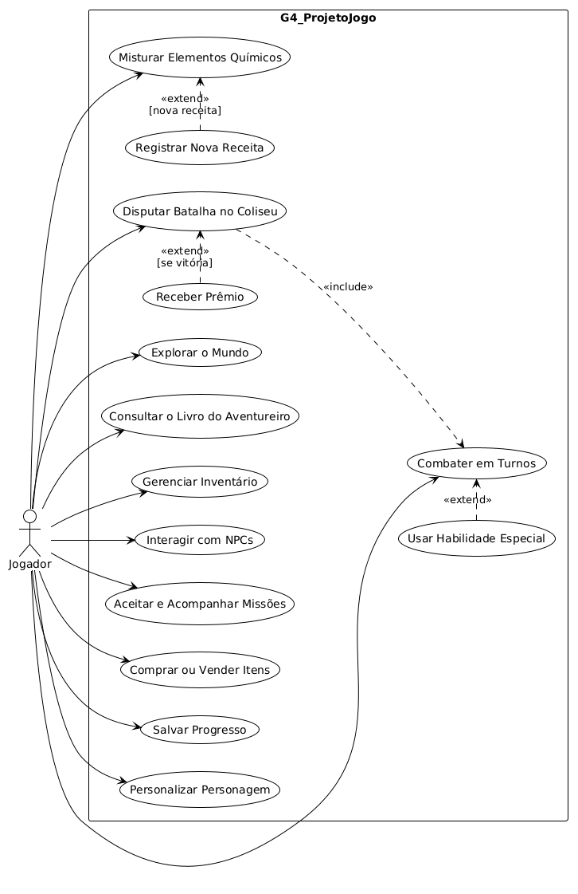
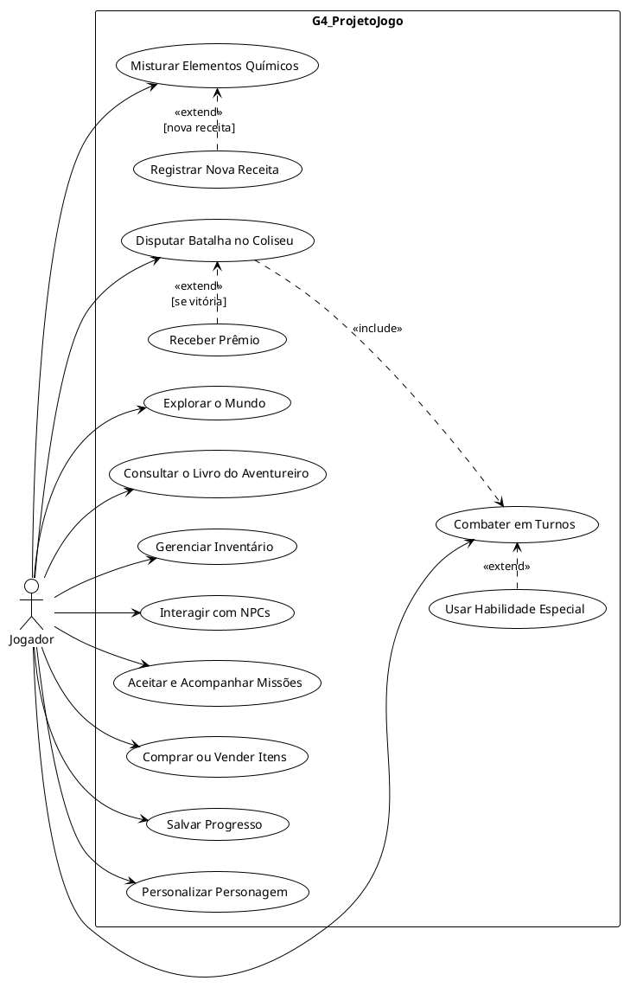

# Iniciativas Extras: Modelagem Organizacional na Notação UML

## Descrição

Iniciativa extra do Grupo 04 no escopo do **Módulo Modelagem**: a **Modelagem Organizacional na notação UML** do **G4_ProjetoJogo**, expressa pelo **Diagrama de Casos de Uso**. O artefato descreve as funcionalidades do jogo sob a perspectiva do usuário e complementa a [Modelagem Estática](ModelagemEstatica.md) e a [Modelagem Dinâmica](ModelagemDinamica.md).

## Objetivo

Registrar uma iniciativa além da entrega mínima do módulo, com um recurso adicional da notação UML: o Diagrama de Casos de Uso. Com ele, pretende-se: (i) explicitar os **atores** e as **funcionalidades** do jogo sob a perspectiva do usuário; (ii) **reforçar a rastreabilidade** entre os artefatos, ligando cada caso de uso aos componentes da modelagem estática e às interações da modelagem dinâmica; e (iii) **sintetizar o escopo funcional** do jogo para a apresentação do trabalho.

## Metodologia

A modelagem organizacional conecta o software ao seu contexto de uso ao descrever atores, papéis e interações com o sistema (BOOCH; RUMBAUGH; JACOBSON, 2005). O Diagrama de Casos de Uso foi adotado como iniciativa extra por oferecer uma visão de alto nível centrada no jogador, complementar às visões estrutural e comportamental dos demais artefatos.

A elaboração seguiu quatro etapas:

1. **Identificação do ator**: o único ator modelado é o **Jogador**, que controla o protagonista em todas as interações, conforme a [definição oficial do projeto](../../../Projeto/Projeto.md);
2. **Derivação dos casos de uso**: os casos foram derivados dos componentes da [Modelagem Estática](ModelagemEstatica.md), das interações da [Modelagem Dinâmica](ModelagemDinamica.md) e das funcionalidades descritas no projeto;
3. **Definição das relações «include» e «extend»**: as dependências entre casos de uso foram ancoradas nas condições de guarda da Modelagem Dinâmica (`[nova receita]` e `[se vitória]`);
4. **Diagramação em PlantUML**: o diagrama foi descrito como código-fonte no [editor online do PlantUML](https://www.plantuml.com/plantuml/uml/), o mesmo recurso usado na versão 1.0 do Diagrama de Componentes, e exportado para PNG, mantendo o artefato versionável no repositório.

Como o PlantUML posiciona os elementos automaticamente, a disposição visual segue o seu algoritmo de layout, mesma limitação registrada na versão 1.0 do Diagrama de Componentes. Como senso crítico, registra-se que o Diagrama de Casos de Uso **não substitui** os modelos estático e dinâmico: sua contribuição está em comunicar a fronteira e o escopo funcional do sistema, servindo de elo entre os demais artefatos.

## Conteúdo

### Atores e Fronteira do Sistema

| Ator | Descrição | Casos de uso associados |
| :--- | :--- | :--- |
| **Jogador** | Controla o protagonista na exploração e no combate; interage com NPCs, lojas e o Coliseu; gerencia itens e receitas; decide quando salvar o progresso. | UC01 a UC13 |

Tabela 1: Atores do Diagrama de Casos de Uso. Fonte: FARIAS, João Victor (2026).

Todos os casos de uso estão na fronteira do sistema (**G4_ProjetoJogo**). Não há ator secundário: persistência e demais serviços são componentes internos do jogo, não entidades externas.

### Modelagem Organizacional: Diagrama de Casos de Uso

Figura 1: Diagrama de Casos de Uso da modelagem organizacional na notação UML. Fonte: FARIAS, João Victor (2026).

### Casos de Uso

Os elos da última coluna são links para as origens de cada caso de uso: os componentes da [Modelagem Estática](ModelagemEstatica.md) e as interações da [Modelagem Dinâmica](ModelagemDinamica.md).

| Nº | Caso de Uso | Descrição | Elos (componentes e interações) |
| :--: | :--- | :--- | :--- |
| UC01 | Explorar o Mundo | Movimenta o protagonista pelo mundo semiaberto; os *colliders* disparam encontros e demais gatilhos. | [Movimentação Livre; Interação e Gatilhos](ModelagemEstatica.md?id=diagrama-de-componentes) |
| UC02 | Combater em Turnos | Enfrenta inimigos em batalhas por turnos, com menu de ações e sincronização de turnos com a IA. | [Motor de Batalha (ATB); IA de Inimigos](ModelagemEstatica.md?id=diagrama-de-componentes) · [Interação 1](ModelagemDinamica.md?id=interação-1-turno-de-combate) |
| UC03 | Usar Habilidade Especial | Extensão de UC02: emprega golpes exclusivos durante o turno de combate. | [Gerenciador de Habilidades Exclusivas](ModelagemEstatica.md?id=diagrama-de-componentes) |
| UC04 | Misturar Elementos Químicos | Combina elementos coletados para criar itens, consumindo reagentes do inventário. | [Mistura de Elementos Químicos; Gerenciador de Inventário](ModelagemEstatica.md?id=diagrama-de-componentes) · [Interação 1](ModelagemDinamica.md?id=interação-1-turno-de-combate) e [Interação 2](ModelagemDinamica.md?id=interação-2-mistura-e-descoberta) |
| UC05 | Registrar Nova Receita | Extensão de UC04: registra no Livro do Aventureiro uma receita inédita obtida na mistura (`[nova receita]`). | [Livro do Aventureiro; SistemaSalvar](ModelagemEstatica.md?id=diagrama-de-componentes) · [Interação 2](ModelagemDinamica.md?id=interação-2-mistura-e-descoberta) |
| UC06 | Consultar o Livro do Aventureiro | Consulta as receitas descobertas e a lore registrada. | [Livro do Aventureiro](ModelagemEstatica.md?id=diagrama-de-componentes) |
| UC07 | Gerenciar Inventário | Organiza e consulta itens e reagentes; base para *crafting*, lojas, Coliseu e batalha. | [Gerenciador de Inventário](ModelagemEstatica.md?id=diagrama-de-componentes) |
| UC08 | Interagir com NPCs | Ativa *colliders* de NPCs e inicia conversas. | [Interação e Gatilhos; Controlador de NPCs](ModelagemEstatica.md?id=diagrama-de-componentes) |
| UC09 | Aceitar e Acompanhar Missões | Inicia *sidequests* oferecidas por NPCs e acompanha o progresso no Jornal de Missões. | [Jornal de Missões; Controlador de NPCs](ModelagemEstatica.md?id=diagrama-de-componentes) |
| UC10 | Comprar ou Vender Itens | Negocia com mercadores; a compra debita ouro e transfere o item ao inventário. | [Lojas (Merchants); Menu de Status; Gerenciador de Inventário](ModelagemEstatica.md?id=diagrama-de-componentes) · [Interação 4](ModelagemDinamica.md?id=interação-4-interação-de-loja) |
| UC11 | Disputar Batalha no Coliseu | Aposta um item e disputa uma batalha com regras de arena próprias. | [O Coliseu; Motor de Batalha (ATB)](ModelagemEstatica.md?id=diagrama-de-componentes) · [Interação 3](ModelagemDinamica.md?id=interação-3-batalha-no-coliseu) |
| UC12 | Salvar Progresso | Persiste status, itens, descobertas e progresso em pontos de salvamento e gatilhos. | [SistemaSalvar](ModelagemEstatica.md?id=diagrama-de-componentes) · [Interação 2](ModelagemDinamica.md?id=interação-2-mistura-e-descoberta) e [Interação 3](ModelagemDinamica.md?id=interação-3-batalha-no-coliseu) |
| UC13 | Personalizar Personagem | Ajusta a aparência e os atributos do protagonista. | [Personalização do Personagem; Menu de Status](ModelagemEstatica.md?id=diagrama-de-componentes) |
| UC14 | Receber Prêmio | Extensão de UC11: recebe o prêmio ao vencer a batalha no Coliseu (`[se vitória]`). | [O Coliseu; Gerenciador de Inventário](ModelagemEstatica.md?id=diagrama-de-componentes) · [Interação 3](ModelagemDinamica.md?id=interação-3-batalha-no-coliseu) |

Tabela 2: Casos de uso do diagrama e seus elos de rastreabilidade. Fonte: FARIAS, João Victor (2026).

### Relações «include» e «extend»

| Origem | Relação | Destino | Condição | Elo |
| :--- | :--: | :--- | :--- | :--- |
| UC03 Usar Habilidade Especial | «extend» | UC02 Combater em Turnos | Quando o jogador opta por um golpe especial no turno. | Invocação de golpes especiais (*[Motor de Batalha](ModelagemEstatica.md?id=diagrama-de-componentes) → [Habilidades Exclusivas](ModelagemEstatica.md?id=diagrama-de-componentes)*) |
| UC05 Registrar Nova Receita | «extend» | UC04 Misturar Elementos Químicos | `[nova receita]`: apenas quando a combinação é inédita. | Guarda `[nova receita]` da [Interação 2](ModelagemDinamica.md?id=interação-2-mistura-e-descoberta) |
| UC11 Disputar Batalha no Coliseu | «include» | UC02 Combater em Turnos | Sem condição: a arena reutiliza o motor de batalha. | Regras de arena (*[Coliseu](ModelagemEstatica.md?id=diagrama-de-componentes) → [Motor de Batalha](ModelagemEstatica.md?id=diagrama-de-componentes)*); [Interação 3](ModelagemDinamica.md?id=interação-3-batalha-no-coliseu) |
| UC14 Receber Prêmio | «extend» | UC11 Disputar Batalha no Coliseu | `[se vitória]`: apenas se o jogador vencer a batalha. | Guarda `[se vitória]` da [Interação 3](ModelagemDinamica.md?id=interação-3-batalha-no-coliseu) |

Tabela 3: Relações «include» e «extend» e suas condições. Fonte: FARIAS, João Victor (2026).

### Código-Fonte do Diagrama

O código PlantUML utilizado para gerar a Figura 1 está abaixo. Para reproduzi-lo, basta colar o conteúdo no [editor online do PlantUML](https://www.plantuml.com/plantuml/uml/).

Clique para expandir o código-fonte (PlantUML)

Código 1: Código-fonte em PlantUML do Diagrama de Casos de Uso. Fonte: FARIAS, João Victor (2026).

### Lista de Requisitos Iniciais

A tabela a seguir reúne os 43 requisitos iniciais elicitados para o G4_ProjetoJogo, usados como inspiração para as modelagens.

Como se trata de uma lista inicial, nem todos os requisitos chegaram às modelagens: alguns não eram adequados ao escopo do jogo e às decisões de projeto, e outros ficaram fora do recorte desta entrega. Os itens não contemplados aparecem com fundo avermelhado na tabela; os demais foram usados nos artefatos modelados (Modelagem Estática, Modelagem Dinâmica e Diagrama de Casos de Uso).

<!-- Linhas com class="nao" destacam os requisitos não contemplados nas modelagens. -->

<table class="tabela-requisitos">
<thead>
<tr>
<th>Nº</th>
<th>Nome (verbo + substantivo)</th>
<th>Requisito (completo)</th>
<th>Usado nas modelagens?</th>
</tr>
</thead>
<tbody>
<tr><td>1</td><td>Mover o jogador</td><td>Poder mover o jogador nas quatro direções cardeais</td><td>Sim</td></tr>
<tr><td>2</td><td>Explorar o mundo semiaberto</td><td>Poder explorar livremente as áreas delimitadas do mundo entre os combates</td><td>Sim</td></tr>
<tr class="nao"><td>3</td><td>Consultar o minimapa</td><td>Poder consultar um minimapa dinâmico com a posição atual e a topologia da área</td><td>Não</td></tr>
<tr><td>4</td><td>Coletar elementos químicos</td><td>Poder coletar elementos químicos da tabela periódica espalhados pelo mundo</td><td>Sim</td></tr>
<tr class="nao"><td>5</td><td>Encontrar tesouros</td><td>Poder encontrar tesouros durante a exploração</td><td>Não</td></tr>
<tr><td>6</td><td>Salvar o progresso</td><td>Poder salvar o progresso da partida ao interagir com um savepoint</td><td>Sim</td></tr>
<tr><td>7</td><td>Retornar ao savepoint</td><td>Poder retornar ao último savepoint registrado após um game over</td><td>Sim</td></tr>
<tr><td>8</td><td>Iniciar a batalha</td><td>Poder iniciar uma batalha ao encontrar um inimigo durante a exploração</td><td>Sim</td></tr>
<tr><td>9</td><td>Definir o tipo de início</td><td>Poder iniciar a batalha como normal, preemptiva ou emboscada, informando o jogador</td><td>Sim</td></tr>
<tr><td>10</td><td>Preencher a barra de ATB</td><td>Poder preencher a barra de ATB de cada combatente em função de seu atributo de velocidade</td><td>Sim</td></tr>
<tr><td>11</td><td>Exibir o menu de comandos</td><td>Poder exibir o menu de comandos do personagem quando sua barra de ATB completar</td><td>Sim</td></tr>
<tr><td>12</td><td>Atacar o inimigo</td><td>Poder atacar um inimigo, subtraindo o dano calculado de seu HP</td><td>Sim</td></tr>
<tr><td>13</td><td>Usar um item</td><td>Poder consumir um item do inventário durante a batalha, removendo uma unidade do estoque</td><td>Sim</td></tr>
<tr><td>14</td><td>Fugir da batalha</td><td>Poder tentar fugir da batalha, encerrando o combate sem vitória nem game over quando bem-sucedida</td><td>Sim</td></tr>
<tr><td>15</td><td>Selecionar o alvo</td><td>Poder selecionar o alvo da ação antes de sua execução</td><td>Sim</td></tr>
<tr><td>16</td><td>Consumir o custo da ação</td><td>Poder debitar do personagem o custo da ação escolhida no momento de sua execução</td><td>Sim</td></tr>
<tr class="nao"><td>17</td><td>Exibir o feedback de dano</td><td>Poder exibir o dano causado sobre o alvo de forma visual e numérica</td><td>Não</td></tr>
<tr><td>18</td><td>Encerrar a batalha por vitória</td><td>Poder encerrar a batalha quando todos os inimigos forem derrotados</td><td>Sim</td></tr>
<tr><td>19</td><td>Distribuir as recompensas</td><td>Poder distribuir experiência, moeda e loot ao jogador ao final de uma batalha vencida</td><td>Sim</td></tr>
<tr><td>20</td><td>Encerrar a batalha por derrota</td><td>Poder encerrar a partida em game over quando o HP do jogador chegar a 0</td><td>Sim</td></tr>
<tr><td>21</td><td>Misturar elementos químicos</td><td>Poder combinar dois ou mais elementos químicos fora da batalha, consultando a tabela de reações</td><td>Sim</td></tr>
<tr><td>22</td><td>Criar um item</td><td>Poder produzir um novo item a partir de uma combinação válida, adicionando-o ao inventário</td><td>Sim</td></tr>
<tr><td>23</td><td>Tratar a mistura inválida</td><td>Poder consumir os elementos sem gerar item quando a combinação for inválida</td><td>Sim</td></tr>
<tr><td>24</td><td>Registrar a receita</td><td>Poder registrar automaticamente no Livro do Aventureiro cada receita descoberta</td><td>Sim</td></tr>
<tr><td>25</td><td>Consultar o Livro do Aventureiro</td><td>Poder consultar as receitas já descobertas sem depender de tentativa e erro</td><td>Sim</td></tr>
<tr><td>26</td><td>Gerenciar o inventário</td><td>Poder visualizar e organizar os itens e elementos químicos que o jogador possui</td><td>Sim</td></tr>
<tr><td>27</td><td>Acumular experiência</td><td>Poder acumular experiência ao derrotar inimigos e concluir missões</td><td>Sim</td></tr>
<tr class="nao"><td>28</td><td>Upar o personagem</td><td>Poder subir de nível ao acumular experiência suficiente, elevando HP, MP e dano</td><td>Não</td></tr>
<tr class="nao"><td>29</td><td>Evoluir a árvore de habilidades</td><td>Poder desbloquear novas habilidades em uma árvore de progressão</td><td>Não</td></tr>
<tr><td>30</td><td>Personalizar o personagem</td><td>Poder alterar a aparência do personagem sem afetar o resultado das batalhas</td><td>Sim</td></tr>
<tr><td>31</td><td>Comprar itens do NPC</td><td>Poder adquirir itens e elementos químicos com NPCs vendedores</td><td>Sim</td></tr>
<tr class="nao"><td>32</td><td>Melhorar o equipamento</td><td>Poder melhorar o equipamento do jogador junto ao Ferreiro da vila</td><td>Não</td></tr>
<tr><td>33</td><td>Aceitar uma sidequest</td><td>Poder aceitar missões secundárias oferecidas por NPCs quest-givers</td><td>Sim</td></tr>
<tr><td>34</td><td>Acompanhar as missões</td><td>Poder acompanhar o progresso das missões ativas na tela atual, sem navegar por menus anteriores</td><td>Sim</td></tr>
<tr class="nao"><td>35</td><td>Enfrentar um boss</td><td>Poder enfrentar inimigos do tipo boss ao final das etapas da história</td><td>Não</td></tr>
<tr><td>36</td><td>Progredir na história linear</td><td>Poder progredir pelos eventos principais em sequência fixa até zerar o jogo</td><td>Sim</td></tr>
<tr><td>37</td><td>Exibir o HUD de batalha</td><td>Poder exibir HP, MP, efeitos de status e o menu de ações durante todo o combate</td><td>Sim</td></tr>
<tr class="nao"><td>38</td><td>Exibir dicas contextuais</td><td>Poder exibir dicas contextuais que orientem o jogador sobre objetivos, controles e mecânicas</td><td>Não</td></tr>
<tr><td>39</td><td>Mapear os botões</td><td>Poder remapear os botões de comando conforme a preferência do jogador</td><td>Sim</td></tr>
<tr class="nao"><td>40</td><td>Confirmar ações irreversíveis</td><td>Poder exigir confirmação antes de ações irreversíveis, como vender itens raros</td><td>Não</td></tr>
<tr><td>41</td><td>Explicar a falha da ação</td><td>Poder informar o motivo de uma ação ter falhado e como corrigi-la</td><td>Sim</td></tr>
<tr class="nao"><td>42</td><td>Gerar encontros procedurais</td><td>Poder gerar mapas e encontros proceduralmente para sustentar a rejogabilidade</td><td>Não</td></tr>
<tr class="nao"><td>43</td><td>Viajar rapidamente</td><td>Poder deslocar-se rapidamente entre áreas já visitadas</td><td>Não</td></tr>
</tbody>
</table>

Tabela 4: Lista de requisitos iniciais do G4_ProjetoJogo, inspiração das modelagens. Fonte: FARIAS, João Victor; LOPES, Marcelo de Araújo (2026).

## Referências

BOOCH, Grady; RUMBAUGH, James; JACOBSON, Ivar. **UML: Guia do Usuário**. 2. ed. Rio de Janeiro: Elsevier, 2005.

FOWLER, Martin. **UML Essencial: um breve guia para a linguagem-padrão de modelagem de objetos**. 3. ed. Porto Alegre: Bookman, 2005.

OMG. **Unified Modeling Language Specification, version 2.5.1**. Object Management Group, 2017. Disponível em: <https://www.omg.org/spec/UML/2.5.1/>. Acesso em: 17 set. 2026.

UML-DIAGRAMS.ORG. **UML Use Case Diagrams**. Disponível em: <https://www.uml-diagrams.org/use-case-diagrams.html>. Acesso em: 17 set. 2026.

## Nível de Contribuição dos Integrantes

| Nome | % de Contribuição |
|------|-------------------|
| João Igor Pereira da Costa | 25% |
| João Victor da Silva Batista de Farias | 25% |
| Marcelo de Araújo Lopes | 25% |
| Marcos Vinícius de Oliveira | 25% |

Tabela 5: Contribuição dos integrantes.

## Histórico de Versão

| Versão | Data | Descrição | Autor(es) | Revisor |
|:------:|------|:----------|:----------|:--------|
|  1.0   | 17/09 | Adição da iniciativa extra: Modelagem Organizacional na notação UML com o Diagrama de Casos de Uso | [João Victor](https://github.com/beyondmagic) | [João Igor](https://github.com/JoaoPC10) |
|  1.1   | 17/09 | Correção da renderização da imagem no GitHub Pages (troca de `` por sintaxe Markdown) | [João Victor](https://github.com/beyondmagic) |         |
|  1.2   | 17/09 | Adição da lista de requisitos iniciais que inspirou as modelagens | [João Victor](https://github.com/beyondmagic) |         |
|  1.3   | 17/09 | Fundo avermelhado nas linhas dos requisitos não usados e correção de digitação na tabela | [João Victor](https://github.com/beyondmagic) |         |
|  1.4   | 17/09 | Adição de explicação sobre os requisitos não contemplados nas modelagens | [João Victor](https://github.com/beyondmagic) |         |
|  1.5   | 17/09 | Correção dos links relativos e ajuste da redação após a movimentação da página | [João Victor](https://github.com/beyondmagic) |         |
|  1.6   | 17/09 | Adição de contribuição de todos os membros do subgrupo e atualização da tabela de histórico de versão | [João Victor](https://github.com/beyondmagic) | [Marcos Vinícius](https://github.com/MarcosViniciusG) |

Tabela 6: Histórico de versão.

Ver também: [Modelagem Estática na Notação UML](ModelagemEstatica.md) · [Modelagem Dinâmica na Notação UML](ModelagemDinamica.md) · [Participações](../../1.2.ParticipacoesModelagem.md)
