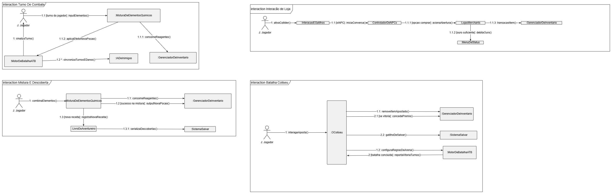
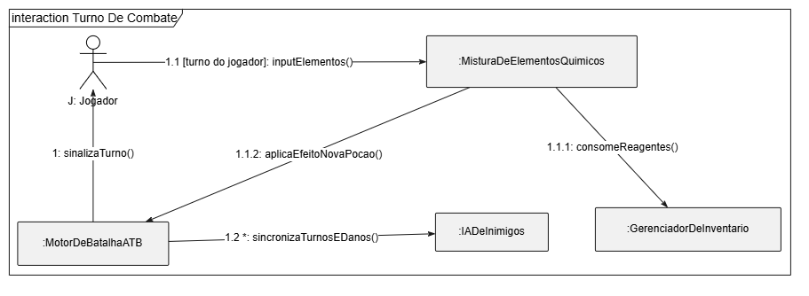
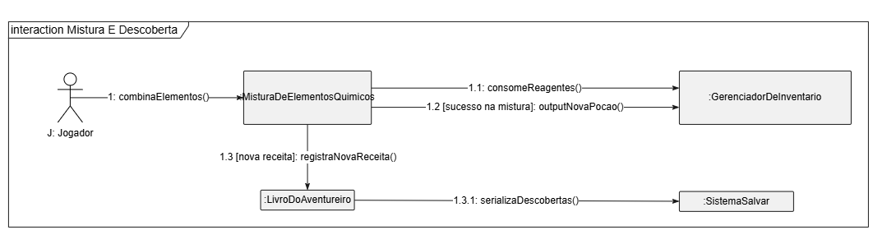
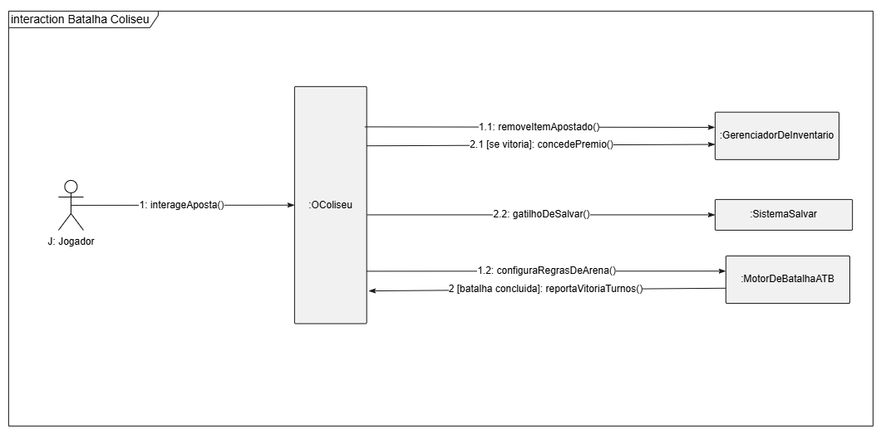
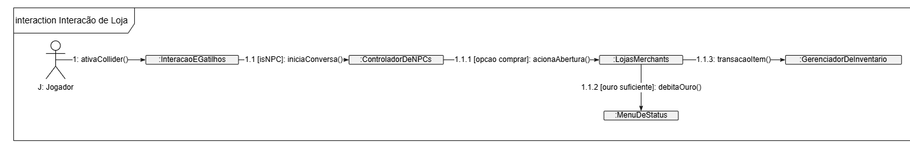
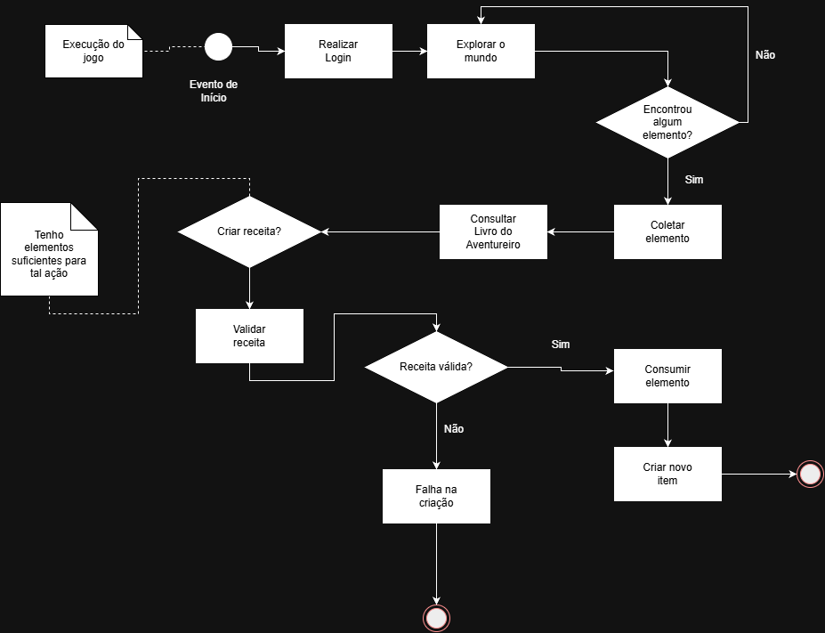
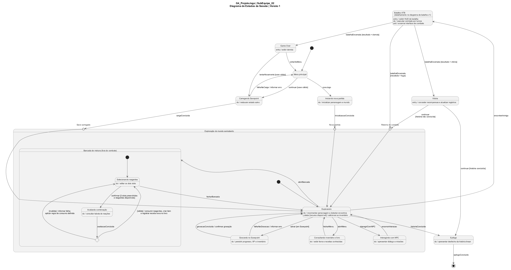
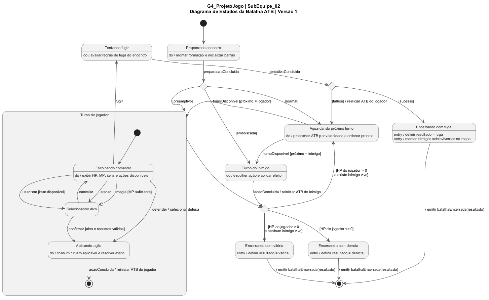

# SubEquipe_02 — Modelagem Dinâmica na Notação UML

## Descrição

Modelagem de processo de negócio da SubEquipe_02, no escopo do **FOCO_02 — Modelagem Dinâmica na Notação UML**. Representa, na notação UML, a modelagem dinâmica do software.

## Objetivo

Elaborar em UML uma modelagem dinâmica pela subequipe, evidenciando as atividades, os eventos e os pontos de decisão do processo.

## Metodologia

A Modelagem Dinâmica é aplicada na fase de análise e projeto de sistemas orientados a objetos para representar o comportamento do sistema ao longo do tempo. No projeto, ela foi empregada para especificar a lógica de execução e a coordenação temporal das interações entre os objetos em cenários críticos.

A elaboração dos diagramas foi conduzida na plataforma web **Draw.io** (*diagrams.net*). A escolha da ferramenta fundamentou-se em sua conformidade com a notação padrão da UML, além da facilidade de versionamento e portabilidade para documentações técnicas em formato digital (PENDER, 2003).

A modelagem dinâmica descreve o comportamento do sistema ao longo do tempo, complementando a visão estrutural fornecida pela modelagem estática. Enquanto os diagramas estruturais mostram quais elementos compõem o sistema, os diagramas de interação mostram como esses elementos colaboram para realizar uma funcionalidade (BOOCH; RUMBAUGH; JACOBSON, 2005).

Para esta entrega, a subequipe optou pelo **Diagrama de Comunicação**. Conforme Fowler (2005), os diagramas de comunicação e os de sequência são semanticamente equivalentes, ambos representam trocas de mensagens entre objetos, porém enfatizam aspectos distintos: o diagrama de sequência destaca a ordem temporal das mensagens, ao passo que o diagrama de comunicação destaca os vínculos estruturais entre os objetos participantes. Essa segunda ênfase foi considerada mais adequada ao momento do projeto, pois permite verificar diretamente se as colaborações previstas nos fluxos do jogo são suportadas pelos componentes definidos na modelagem estática.

O processo seguido foi dividido em quatro etapas:

1. **Seleção dos cenários**: a partir dos fluxos centrais do jogo, foram escolhidas quatro interações representativas: o turno de combate, a mistura de elementos, a batalha no Coliseu e a interação com as lojas;
2. **Identificação dos participantes**: para cada cenário, foram levantados os objetos envolvidos, reutilizando os nomes dos componentes já definidos na [Modelagem Estática](ModelagemEstatica.md), de modo a manter a rastreabilidade entre os dois modelos;
3. **Definição das mensagens**: as chamadas entre os objetos foram nomeadas como operações (`inputElementos()`, `consomeReagentes()`, `concedePremio()`) e numeradas segundo o esquema decimal aninhado da UML, com a inclusão de condições de guarda nos pontos de decisão;
4. **Diagramação**: as quatro interações foram desenhadas na plataforma [Draw.io](https://app.diagrams.net/), cada uma delimitada por um *frame* `interaction` próprio, e reunidas em uma única prancha para permitir tanto a leitura individual quanto a visão de conjunto.

A ferramenta **Draw.io** foi escolhida por disponibilizar uma biblioteca de formas aderente à notação UML e por permitir o posicionamento direto dos objetos e das mensagens com o mouse, o que se mostrou decisivo em um diagrama cujo entendimento depende fortemente da disposição espacial dos participantes.

Como achado principal, a modelagem evidenciou que os objetos `:GerenciadorDeInventario` e `:SistemaSalvar` recebem mensagens em praticamente todos os cenários analisados, confirmando o papel central que lhes havia sido atribuído na modelagem estática e reforçando a necessidade de que suas interfaces sejam estáveis, uma vez que qualquer alteração nelas se propaga para múltiplos fluxos do jogo.

## Conteúdo

### Diagrama de Atividade

O diagrama de comunicação é um diagrama de interação que exibe um conjunto de objetos, os vínculos existentes entre eles e as mensagens trocadas para realizar um determinado comportamento. Diferentemente do diagrama de sequência, ele não possui um eixo temporal explícito: a ordem das mensagens é expressa exclusivamente pela sua numeração (OMG, 2017).

Na UML, um diagrama de atividade fornece uma visualização do comportamento de um sistema, descrevendo a sequência de ações em um processo. Os diagramas de atividades são semelhantes aos fluxogramas porque representam o fluxo entre as ações em uma atividade; no entanto, eles são mais poderosos, pois também podem ilustrar fluxos paralelos ou simultâneos, fluxos alternativos (condicionais) e estruturas de sincronização entre diferentes caminhos de execução.

Sua utilização no projeto tem por finalidade:

* **Detalhar os cenários** mais relevantes da jogabilidade em termos de troca de mensagens;
* **Validar a arquitetura** definida na modelagem estática, verificando se os componentes possuem os vínculos necessários para realizar cada fluxo;
* **Explicitar as condições** que direcionam o comportamento do sistema, por meio das guardas associadas às mensagens;
* **Identificar acoplamentos**, revelando os objetos que concentram o maior número de colaborações;
* **Orientar a implementação**, já que cada mensagem corresponde a uma operação a ser codificada.

### Elementos Essenciais do Diagrama de Comunicação

| Elemento | Descrição | Exemplo no diagrama |
| :--- | :--- | :--- |
| **Ator** | Entidade externa que inicia a interação com o sistema. | `J: Jogador` |
| **Objeto / Instância** | Participante da interação, nomeado no formato `nome:Classe`. | `:MotorDeBatalhaATB`, `:LivroDoAventureiro` |
| **Vínculo (*link*)** | Linha que conecta dois participantes, indicando que existe um caminho de comunicação entre eles. | `J: Jogador` — `:MisturaDeElementosQuimicos` |
| **Mensagem** | Seta rotulada sobre o vínculo, representando a chamada de uma operação. | `1.1.1: consomeReagentes()` |
| **Numeração aninhada** | Sequência decimal que expressa a ordem e o aninhamento das chamadas. | `1`, `1.1` e `1.1.1` |
| **Condição de guarda** | Expressão entre colchetes que condiciona o envio da mensagem. | `[sucesso na mistura]`, `[se vitoria]` |
| **Marcador de iteração** | Asterisco que indica envio repetido da mensagem. | `1.2 *: sincronizaTurnosEDanos()` |
| ***Frame* de interação** | Moldura que delimita e nomeia o cenário representado. | `interaction Turno De Combate` |

### Modelagem Dinâmica: Diagrama de Comunicação

A prancha a seguir reúne as quatro interações modeladas pela subequipe. Em razão da sua extensão, cada cenário é apresentado individualmente nas subseções seguintes.

Figura 1: Modelo Dinâmico na notação UML — visão geral das quatro interações. Fonte: SILVA, Marcos (2026).

---

#### Interação 1: Turno de Combate

Este cenário representa o ciclo de um turno no sistema de batalha. O `:MotorDeBatalhaATB` sinaliza ao jogador que o seu turno começou; caso a ação escolhida seja a utilização de elementos químicos, a mistura consome os reagentes do inventário e devolve o efeito da poção ao motor de batalha. Em paralelo, o motor mantém a sincronização contínua com a inteligência artificial dos inimigos, comportamento representado pelo marcador de iteração.

Figura 2: Interação "Turno de Combate". Fonte: SILVA, Marcos (2026).

| Nº | Mensagem | Origem | Destino |
| :--- | :--- | :--- | :--- |
| 1 | `sinalizaTurno()` | `:MotorDeBatalhaATB` | `J: Jogador` |
| 1.1 | `[turno do jogador]: inputElementos()` | `J: Jogador` | `:MisturaDeElementosQuimicos` |
| 1.1.1 | `consomeReagentes()` | `:MisturaDeElementosQuimicos` | `:GerenciadorDeInventario` |
| 1.1.2 | `aplicaEfeitoNovaPocao()` | `:MisturaDeElementosQuimicos` | `:MotorDeBatalhaATB` |
| 1.2 | `*: sincronizaTurnosEDanos()` | `:MotorDeBatalhaATB` | `:IADeInimigos` |

Tabela 1: Mensagens da interação "Turno de Combate".

---

#### Interação 2: Mistura e Descoberta

Este cenário detalha o sistema de *crafting* químico fora do combate. O jogador combina elementos, o que consome reagentes do inventário e, em caso de sucesso, devolve a nova poção ao mesmo inventário. Quando a combinação resulta em uma receita inédita, ela é registrada no Livro do Aventureiro, que por sua vez aciona a serialização das descobertas, garantindo a persistência do progresso.

Figura 3: Interação "Mistura e Descoberta". Fonte: SILVA, Marcos (2026).

| Nº | Mensagem | Origem | Destino |
| :--- | :--- | :--- | :--- |
| 1 | `combinaElementos()` | `J: Jogador` | `:MisturaDeElementosQuimicos` |
| 1.1 | `consomeReagentes()` | `:MisturaDeElementosQuimicos` | `:GerenciadorDeInventario` |
| 1.2 | `[sucesso na mistura]: outputNovaPocao()` | `:MisturaDeElementosQuimicos` | `:GerenciadorDeInventario` |
| 1.3 | `[nova receita]: registraNovaReceita()` | `:MisturaDeElementosQuimicos` | `:LivroDoAventureiro` |
| 1.3.1 | `serializaDescobertas()` | `:LivroDoAventureiro` | `:SistemaSalvar` |

Tabela 2: Mensagens da interação "Mistura e Descoberta".

---

#### Interação 3: Batalha no Coliseu

Este cenário representa o modo de jogo do Coliseu, no qual o jogador aposta um item para disputar uma batalha. Ao receber a aposta, `:OColiseu` remove o item apostado do inventário e configura as regras da arena junto ao motor de batalha. Concluído o combate, o motor reporta o resultado e, havendo vitória, o prêmio é concedido e o estado do jogo é salvo.

Figura 4: Interação "Batalha no Coliseu". Fonte: SILVA, Marcos (2026).

| Nº | Mensagem | Origem | Destino |
| :--- | :--- | :--- | :--- |
| 1 | `interageAposta()` | `J: Jogador` | `:OColiseu` |
| 1.1 | `removeItemApostado()` | `:OColiseu` | `:GerenciadorDeInventario` |
| 1.2 | `configuraRegrasDeArena()` | `:OColiseu` | `:MotorDeBatalhaATB` |
| 2 | `[batalha concluida]: reportaVitoriaTurnos()` | `:MotorDeBatalhaATB` | `:OColiseu` |
| 2.1 | `[se vitoria]: concedePremio()` | `:OColiseu` | `:GerenciadorDeInventario` |
| 2.2 | `gatilhoDeSalvar()` | `:OColiseu` | `:SistemaSalvar` |

Tabela 3: Mensagens da interação "Batalha no Coliseu".

---

#### Interação 4: Interação de Loja

Este cenário descreve a compra de itens junto aos mercadores. O fluxo tem início quando o jogador ativa o *collider* de um NPC; identificado o NPC, a conversa é iniciada e, caso a opção de compra seja escolhida, a interface da loja é aberta. Havendo ouro suficiente, o valor é debitado no menu de status e o item é transferido para o inventário do jogador.

Figura 5: Interação "Interação de Loja". Fonte: SILVA, Marcos (2026).

| Nº | Mensagem | Origem | Destino |
| :--- | :--- | :--- | :--- |
| 1 | `ativaCollider()` | `J: Jogador` | `:InteracaoEGatilhos` |
| 1.1 | `[isNPC]: iniciaConversa()` | `:InteracaoEGatilhos` | `:ControladorDeNPCs` |
| 1.1.1 | `[opcao comprar]: acionaAbertura()` | `:ControladorDeNPCs` | `:LojasMerchants` |
| 1.1.2 | `[ouro suficiente]: debitaOuro()` | `:LojasMerchants` | `:MenuDeStatus` |
| 1.1.3 | `transacaoItem()` | `:LojasMerchants` | `:GerenciadorDeInventario` |

Tabela 4: Mensagens da interação "Interação de Loja".

### Elementos Principais

Nos diagramas de atividades, os nós de atividades e os arcos (transições) são utilizados para modelar o fluxo de controle e o fluxo de dados entre as ações:

| Elemento | Representação Visual | Função |
| :--- | :--- | :--- |
| **Nó Inicial** | Círculo sólido preto | Marca o início do fluxo de atividade. |
| **Ação / Atividade** | Retângulo arredondado | Representa um passo de execução ou tarefa no processo. |
| **Decisão** | Losango | Ponto de bifurcação condicional (caminhos alternativos). |
| **Fork / Join** | Barra espessa horizontal | Sincronização ou divisão de fluxos paralelos. |
| **Nó Final** | Círculo duplo (olho de boi) | Indica o encerramento do fluxo. |
| **Transição** | Setas direcionadas | Indicam a direção do fluxo de controle entre os elementos. |

---

### Caso de Uso: Projeto Jogo – Sistema de Crafting

Um diagrama de atividades para o sistema de *crafting* do projeto é particularmente útil para:

* **Visualizar o fluxo completo** de coleta de elementos, validação de receitas e criação de itens;
* **Identificar pontos de decisão** (*Elemento encontrado? Receita válida?*);
* **Documentar caminhos de sucesso e falha** no processo de criação;
* **Servir como base** para a implementação direta das classes e seus métodos correspondentes.

## Modelagem Dinâmica: Diagrama de Atividades

Figura 1: Modelo Dinâmico na notação UML. Fonte: COSTA, João Igor (2026).

---

### Diagrama de Estados

O Diagrama de Máquina de Estados da UML descreve o comportamento de um elemento como um conjunto de estados percorridos em resposta a eventos. Cada transição é rotulada no formato `evento [guarda] / efeito`: o evento dispara a transição, a guarda é a condição que precisa ser verdadeira e o efeito é a ação executada durante a passagem (OBJECT MANAGEMENT GROUP, 2017). Os modelos desta página usam os seguintes recursos da notação:

- **Estados simples com atividades** `entry` (ao entrar), `do` (enquanto permanece) e `exit` (ao sair). Exemplo: o estado Batalha ATB tem `entry / exibir HUD de batalha`, `do / executar combate por turnos` e `exit / encerrar interface de combate`.
- **Estados compostos**, que contêm uma região com estados internos: Exploração do mundo semiaberto, Bancada de mistura (aninhada dentro da Exploração) e Turno do jogador.
- **Pseudoestado inicial e estado final**, delimitando cada máquina e cada região composta.
- **Pseudoestado de escolha** (*choice*), usado nos pontos de decisão do domínio: validade da combinação química, tipo de início do combate, resultado da fuga e desfecho de cada turno.
- **Pontos de entrada** (*entry points*) nomeados na Exploração (Nova partida, Save carregado e Retorno do combate), que deixam explícito **por onde** o jogador chega ao mundo.
- **Transição interna**, que executa um efeito sem sair do estado: em Explorando, `coletar [recurso disponível] / adicionar ao inventário`.
- **Transição de conclusão**, sem evento, que dispara quando a região interna atinge o estado final: é assim que o Turno do jogador termina e passa ao ponto de escolha de fim de turno.
- **Evento de sinal com parâmetro**, `batalhaEncerrada(resultado)`, que conecta as duas máquinas.

#### Por que dois diagramas

Reunir sessão e combate em uma única máquina produz um desenho ilegível, com transições longas cruzando todo o modelo. Por isso a modelagem foi dividida em dois níveis. Na máquina da sessão, a batalha aparece como um **único estado**, Batalha ATB, com suas atividades de entrada, permanência e saída. O que acontece dentro dele é detalhado na máquina da Batalha.

O **contrato entre os dois diagramas** é o sinal `batalhaEncerrada(resultado)`. A máquina da Batalha termina sempre por um de três estados de encerramento (vitória, derrota ou fuga), que definem o valor de `resultado` e emitem o sinal. A máquina da sessão reage a esse mesmo sinal com três transições guardadas: `[resultado = vitória]`, `[resultado = derrota]` e `[resultado = fuga]`. Assim, cada diagrama pode ser lido sozinho, e a ligação entre eles fica verificável pelo nome do evento.

#### Origem dos estados

Nenhum estado foi criado sem base nos artefatos anteriores. O Léxico da subequipe já classificava como **estado** os termos Batalha (L28), Vitória (L29) e Game Over (L30), além de definir a História Linear (L31), que fundamenta o Epílogo. Os demais estados vieram dos verbos e objetos do mesmo Léxico, como Explorar (L12), Misturar Elementos (L09), Criar Item (L10), Savepoint (L27), Inventário (L23), Livro do Aventureiro (L25), Turno (L15) e HUD de Batalha (L16), e dos três frames do modelo BPMN do Motor de Batalha: abertura do encontro com tipo de início, ciclo de ATB com menu de comandos e encerramento com vitória, fuga ou derrota.

---

### Modelagem Dinâmica: Diagrama de Estados da Sessão

A máquina da sessão começa no Menu principal. A partir dele, o jogador inicia uma nova partida ou carrega um Savepoint válido; os dois caminhos entram na Exploração por pontos de entrada distintos, e uma falha de carregamento devolve o jogador ao menu com mensagem de erro. Dentro da Exploração, o estado central é **Explorando**, do qual o jogador sai para interagir com NPCs, consultar inventário e livro, gravar no Savepoint ou abrir a Bancada de mistura. Ao encontrar um inimigo, a sessão passa para Batalha ATB e, conforme o resultado, segue para Vitória, Game Over ou retorna à Exploração pelo ponto Retorno do combate. A partida termina no Epílogo, alcançado quando a história é concluída.

Figura 6: Diagrama de Estados da Sessão de jogo. Fonte: Elaboração própria (SubEquipe_02, 2026).

| Estado | Tipo | Atividades | Principais transições de saída |
|--------|------|------------|--------------------------------|
| Menu principal | simples | Nenhuma | `novoJogo` → Iniciando nova partida; `continuar [save válido]` → Carregando Savepoint |
| Iniciando nova partida | simples | `do / inicializar personagem e mundo` | `inicializacaoConcluida` → Exploração (ponto Nova partida) |
| Carregando Savepoint | simples | `do / restaurar estado salvo` | `cargaConcluida` → Exploração (ponto Save carregado); `falhaNaCarga / informar erro` → Menu principal |
| Exploração do mundo semiaberto | composto | contém Explorando, Interagindo com NPC, Consultando inventário e livro, Gravando no Savepoint e Bancada de mistura | Definidas pelos subestados |
| Explorando | simples | `do / movimentar personagem e detectar encontros`; interna `coletar [recurso disponível] / adicionar ao inventário` | `encontrarInimigo` → Batalha ATB; `historiaConcluida` → Epílogo |
| Interagindo com NPC | simples | `do / apresentar diálogo e missões` | `encerrarInteracao` → Explorando |
| Consultando inventário e livro | simples | `do / exibir itens e receitas conhecidas` | `fecharMenu` → Explorando |
| Gravando no Savepoint | simples | `do / persistir progresso, XP e inventário` | `gravacaoConcluida / confirmar gravação` ou `falhaNaGravacao / informar erro` → Explorando |
| Bancada de mistura | composto | Selecionando reagentes (`do / editar os dois slots`) e Avaliando combinação (`do / consultar tabela de reações`) | `fecharBancada` → Explorando |
| Batalha ATB | simples (detalhado na Figura 2) | `entry / exibir HUD de batalha`, `do / executar combate por turnos`, `exit / encerrar interface de combate` | `batalhaEncerrada` com guarda `[resultado = vitória]`, `[resultado = derrota]` ou `[resultado = fuga]` |
| Vitória | simples | `entry / conceder recompensas e atualizar registros` | `continuar [história não concluída]` → Retorno do combate; `continuar [história concluída]` → Epílogo |
| Game Over | simples | `entry / exibir derrota` | `tentarNovamente [save válido]` → Carregando Savepoint; `voltarAoMenu` → Menu principal |
| Epílogo | simples | `do / apresentar desfecho da história linear` | `epilogoConcluido` → estado final |

Tabela 5: Estados da sessão de jogo. Fonte: Elaboração própria (SubEquipe_02, 2026).

Na **Bancada de mistura**, a transição `confirmar [2 slots preenchidos e reagentes disponíveis]` leva a Avaliando combinação, e o ponto de escolha decide o resultado: `[válida] / consumir reagentes, criar item e registrar receita nova no livro` ou `[inválida] / informar falha; aplicar regra de consumo definida`. Nos dois casos o jogador volta à seleção de reagentes, o que permite tentar outra combinação sem sair da bancada.

---

### Modelagem Dinâmica: Diagrama de Estados da Batalha ATB

A máquina da Batalha começa em Preparando encontro. Um ponto de escolha define o tipo de início: no início **normal** o combate vai para Aguardando próximo turno, em que as barras de ATB se enchem conforme a velocidade; no **preemptivo** o jogador age primeiro; na **emboscada**, o inimigo. O Turno do jogador é um estado composto com a escolha de comando, a seleção de alvo e a aplicação da ação. Ao fim de cada turno, um segundo ponto de escolha verifica o HP do jogador e a existência de inimigos vivos para decidir entre continuar, vencer ou perder. A fuga é tratada por um terceiro ponto de escolha. Todo encerramento emite `batalhaEncerrada(resultado)`, consumido pela máquina da sessão.

Figura 7: Diagrama de Estados da Batalha ATB. Fonte: Elaboração própria (SubEquipe_02, 2026).

| Origem | Destino | Evento [guarda] / efeito |
|--------|---------|--------------------------|
| Preparando encontro | escolha de início | `preparacaoConcluida` |
| escolha de início | Aguardando próximo turno | `[normal]` |
| escolha de início | Turno do jogador | `[preemptivo]` |
| escolha de início | Turno do inimigo | `[emboscada]` |
| Aguardando próximo turno | Turno do jogador | `turnoDisponivel [próximo = jogador]` |
| Aguardando próximo turno | Turno do inimigo | `turnoDisponivel [próximo = inimigo]` |
| Escolhendo comando | Selecionando alvo | `atacar`; `magia [MP suficiente]`; `usarItem [item disponível]` |
| Selecionando alvo | Escolhendo comando | `cancelar` |
| Selecionando alvo | Aplicando ação | `confirmar [alvo e recursos válidos]` |
| Escolhendo comando | Aplicando ação | `defender / selecionar defesa` |
| Aplicando ação | final da região | `acaoConcluida / reiniciar ATB do jogador` |
| Turno do jogador | escolha de fim de turno | transição de conclusão |
| Turno do inimigo | escolha de fim de turno | `acaoConcluida / reiniciar ATB do inimigo` |
| escolha de fim de turno | Encerrando com derrota | `[HP do jogador <= 0]` |
| escolha de fim de turno | Encerrando com vitória | `[HP do jogador > 0 e nenhum inimigo vivo]` |
| escolha de fim de turno | Aguardando próximo turno | `[HP do jogador > 0 e existe inimigo vivo]` |
| Escolhendo comando | Tentando fugir | `fugir` |
| Tentando fugir | escolha de fuga | `tentativaConcluida` |
| escolha de fuga | Aguardando próximo turno | `[falhou] / reiniciar ATB do jogador` |
| escolha de fuga | Encerrando com fuga | `[sucesso]` |
| Encerrando com vitória, derrota ou fuga | estado final | `/ emitir batalhaEncerrada(resultado)` |

Tabela 6: Transições da máquina de estados da Batalha ATB. Fonte: Elaboração própria (SubEquipe_02, 2026).

---

### Rastreabilidade dos Diagramas de Estados

| Elemento dos diagramas | Evidência de origem (SubEquipe_02, Entrega 01) |
|------------------------|------------------------------------------------|
| Estados Batalha ATB, Vitória e Game Over | Léxico L28, L29 e L30, classificados como **estado** no LAL. |
| Bancada de mistura fora do combate | Léxico L28: a Batalha "impede as ações de Explorar e Misturar Elementos enquanto estiver ativa"; L09 e L10. |
| Escolha `[válida]` / `[inválida]` na bancada | BPMN frame 2: consulta à tabela de reações com desfecho de composto estável ou tentativa malsucedida; Léxico L09: combinação inválida "pode consumir os Elementos". |
| Gravando no Savepoint e `tentarNovamente [save válido]` | Léxico L27: o Savepoint "registra o estado atual da partida" e é o "ponto de retorno após um Game Over"; BPMN frame 3. |
| Consultando inventário e livro | Léxico L23 e L25; SIG: Tutorial apoiado pelo Livro do aventureiro. |
| Escolha de início normal, preemptivo ou emboscada | BPMN do Motor de Batalha: gateway "Tipo de início?", com evidência da mensagem "Ataque por trás!". |
| Aguardando próximo turno | BPMN: tarefa *Tick do ATB* em laço, com preenchimento por velocidade. |
| Guardas `magia [MP suficiente]` e `usarItem [item disponível]` | BPMN: tarefa "Consumir custo (PM / reagentes / item)"; Léxico L06 e L18. |
| `entry / exibir HUD de batalha` e `do / exibir HP, MP, itens e ações disponíveis` | SIG do NFR Framework: softgoal Usabilidade/UX, HUD com todas as informações; Léxico L16. |
| `falhaNaCarga / informar erro` e `falhaNaGravacao / informar erro` | Questionário Q8: explicações claras sobre por que uma ação falhou. |
| Encerrando com fuga e `manter inimigos sobreviventes no mapa` | Léxico L07: fuga bem-sucedida encerra a Batalha "sem Vitória nem Game Over"; BPMN frame 3. |
| Epílogo | Léxico L14 (Zerar) e L31 (História Linear). |

Tabela 7: Rastreabilidade entre os Diagramas de Estados e os artefatos da Entrega 01. Fonte: Elaboração própria (SubEquipe_02, 2026).

## Referências

BOOCH, Grady; RUMBAUGH, James; JACOBSON, Ivar. **UML: Guia do Usuário**. 2. ed. Rio de Janeiro: Elsevier, 2005.

FOWLER, Martin. **UML Essencial: um breve guia para a linguagem-padrão de modelagem de objetos**. 3. ed. Porto Alegre: Bookman, 2005.

OMG. **Unified Modeling Language Specification, version 2.5.1**. Object Management Group, 2017. Disponível em: <https://www.omg.org/spec/UML/2.5.1/>. Acesso em: 16 set. 2026.

IBM. **Diagramas de atividade**. IBM Documentation, 2021. Disponível em: <https://www.ibm.com/docs/pt-br/rational-soft-arch/9.7.0?topic=diagrams-activity>. Acesso em: 15 set. 2026.

## Nível de Contribuição dos Integrantes

| Nome | % de Contribuição |
|------|-------------------|
|João Igor |     25%       |
|Marcos Vinícius Gündel da Silva |     25%       |
|Marcelo de Araújo Lopes |     25%       |

Tabela 8: Contribuição dos integrantes.

## Histórico de Versão

| Versão | Data | Descrição | Autor(es) | Revisor |
|:------:|------|:----------|:----------|:--------|
|  1.0   | 15/09|  Adição da literatura correspondente e do Diagrama de Atividade  | [João Igor](https://github.com/JoaoPC10)          |         |
|  1.1   | 16/09|  Adição da literatura correspondente e do Diagrama de Comunicação, com o detalhamento das quatro interações  | [Marcos Vinícius](https://github.com/MarcosViniciusG)          |         |
|  1.2   |17/09 | Correção da renderização das imagens no GitHub Pages (troca de `` por sintaxe Markdown) e dos links de perfil sem `https://` | [Marcos Vinícius](https://github.com/MarcosViniciusG) |         |
|  1.3   |17/09 | Adição dos Diagramas de Estados da sessão e da Batalha ATB, com as tabelas de estados, transições e rastreabilidade | [Marcelo de Araújo Lopes](https://github.com/MatielloAL) |         |

Tabela 9: Histórico de versão.

Ver também: [Modelagem Estática na Notação UML](ModelagemEstatica.md) · [IA Generativa](IAGenerativa.md)
