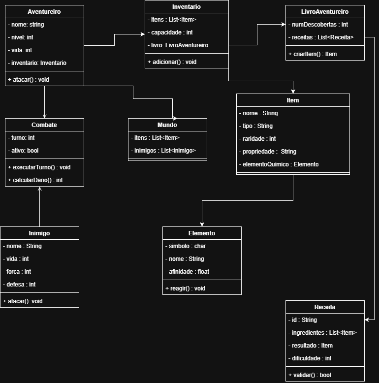
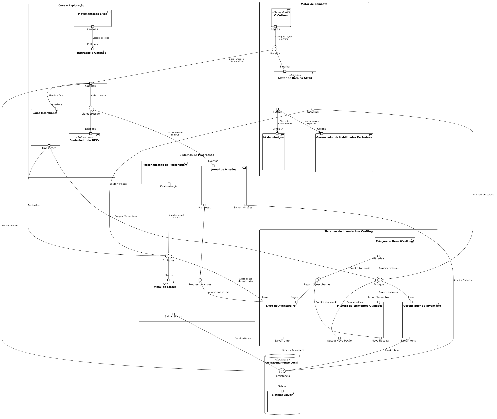
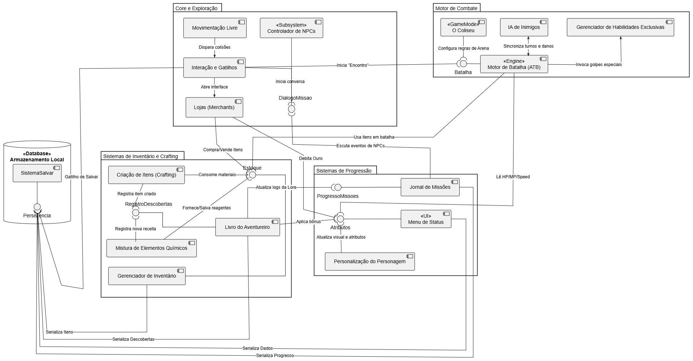
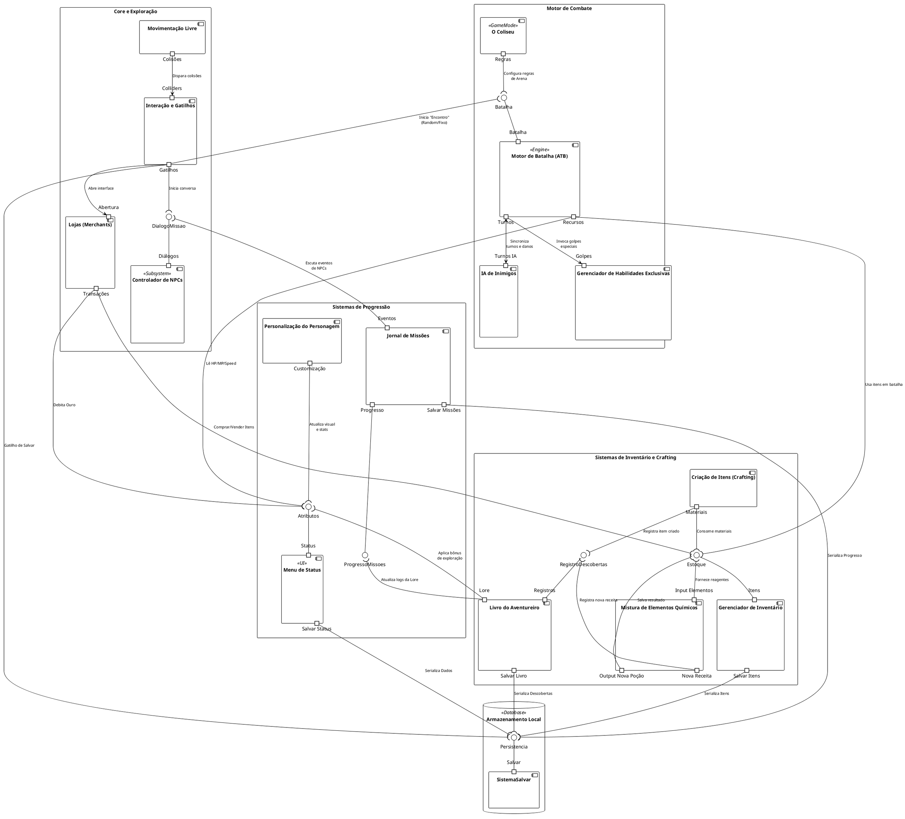

# SubEquipe_02 — Modelagem Estática na Notação UML

## Descrição

Modelagem de processo de negócio da SubEquipe_02, no escopo do **FOCO_01 — Modelagem Estática na Notação UML**. Representa, na notação UML, a modelagem Estática do software.

## Objetivo

Elaborar em UML uma modelagem estática pela subequipe, evidenciando as atividades, os eventos e os pontos de decisão do processo.

## Metodologia

A modelagem estática é definida como um conjunto de atividades sistemáticas para realizar uma tarefa, fornecendo os passos a serem tomados nos diversos estágios do desenvolvimento de software. No presente projeto, a modelagem tem como objetivo elucidar os objetos atuantes no jogo. Para a representação dos diagramas, foi utilizada a plataforma [Draw.io](https://app.diagrams.net/).

Para o Diagrama de Componentes, optou-se pelo **PlantUML** em sua versão de [editor online](https://www.plantuml.com/plantuml/uml/), ferramenta na qual o diagrama é descrito textualmente por meio de uma linguagem de marcação e renderizado automaticamente. A principal vantagem dessa abordagem é o versionamento do diagrama como código-fonte, permitindo que alterações sejam rastreadas no repositório da mesma forma que o código do jogo.

Em contrapartida, a maior dificuldade encontrada com essa ferramenta foi organizar as setas e a localização dos componentes, pois não há como arrastar e colocar os componentes no local certo com o mouse, apenas modificando o código. O posicionamento é determinado pelo algoritmo de layout da ferramenta, de modo que ajustes de disposição precisaram ser feitos indiretamente, por meio da ordem das declarações, da direção explícita das ligações (`-down-`, `-up-`, `-right-`) e de arestas invisíveis (`-[hidden]-`) usadas apenas para forçar o alinhamento desejado entre os pacotes.

Para contornar essa limitação, o código do PlantUML foi importado no [Draw.io](https://app.diagrams.net/), que reconstrói o diagrama como um conjunto de formas editáveis. A partir dessa importação, a disposição dos componentes e o traçado das setas puderam ser ajustados diretamente com o mouse, originando a **versão 1.1** do diagrama. Essa versão preserva integralmente a estrutura e as relações descritas no código-fonte, alterando apenas o aspecto visual e a organização espacial dos elementos.

## Conteúdo

### Diagrama de Classe

Segundo a IBM, os diagramas de classe são fundamentais para o processo de modelagem de objetos, pois modelam a estrutura estática de um sistema. Dependendo da complexidade do projeto, é possível utilizar um único diagrama de classe para representar o sistema inteiro ou múltiplos diagramas para especificar componentes individuais.

---

### Modelagem Estática: Diagrama de Classe

Figura 1: Modelo Estático na notação UML. Fonte: COSTA, João Igor (2026).

Estes diagramas funcionam como representações abstratas da estrutura do sistema ou subsistema e são utilizados para:

* **Modelar os objetos** que compõem o sistema e suas respectivas responsabilidades;
* **Exibir os relacionamentos** entre os objetos (associação, herança, composição, dependência);
* **Descrever as operações** e serviços fornecidos por meio de seus métodos;
* **Especificar os atributos** e propriedades que caracterizam cada objeto;
* **Estabelecer as restrições** e regras de negócio do domínio.

---

### Elementos Essenciais do Diagrama de Classe

| Elemento | Descrição | Exemplo |
| :--- | :--- | :--- |
| **Classes** | Estruturas representadas por retângulos divididos em três seções (nome, atributos e operações). | `Jogador`, `Inimigo` |
| **Atributos** | Características que definem o estado de um objeto. | `vida`, `nome`, `posição` |
| **Métodos / Operações** | Comportamentos e funcionalidades executadas pela classe. | `atacar()`, `coletar()`, `validar()` |
| **Relacionamentos** | Conexões que indicam como as classes interagem entre si. | Associação, Herança, Composição, Agregação |

---

### Diagrama de Componentes

O diagrama de componentes é um diagrama estrutural da UML que exibe a organização e as dependências entre um conjunto de componentes. Conforme Booch, Rumbaugh e Jacobson (2005), um componente é uma parte física e substituível de um sistema, que empacota uma implementação e expõe um conjunto de interfaces, de modo que ele possa ser substituído por outro que respeite as mesmas interfaces sem impacto sobre os demais elementos.

Enquanto o diagrama de classe descreve a estrutura lógica do sistema, o diagrama de componentes atua em um nível de abstração mais alto e é utilizado para:

* **Delimitar os subsistemas** do jogo e agrupar funcionalidades correlatas em pacotes coesos;
* **Explicitar as interfaces** fornecidas e requeridas por cada componente;
* **Evidenciar as dependências** entre os módulos, revelando pontos de acoplamento;
* **Apoiar a divisão do trabalho** de implementação entre os integrantes da equipe;
* **Documentar a arquitetura** de forma independente das classes concretas que a realizam.

### Elementos Essenciais do Diagrama de Componentes

| Elemento | Descrição | Exemplo no diagrama |
| :--- | :--- | :--- |
| **Componente** | Unidade modular e substituível do sistema, representada por um retângulo com o ícone de componente. | `Motor de Batalha (ATB)`, `Gerenciador de Inventário` |
| **Interface Fornecida** | Serviço disponibilizado por um componente, representado pelo símbolo de "pirulito" (*lollipop*). | `Estoque`, `Persistencia` |
| **Interface Requerida** | Serviço consumido por um componente, representado pelo símbolo de "soquete" (*socket*). | `pCra_Materiais -( Estoque` |
| **Porta** | Ponto de interação explícito entre o componente e o seu ambiente. | `portin "Itens"`, `portout "Salvar Itens"` |
| **Pacote** | Agrupamento lógico de componentes relacionados a um mesmo domínio. | `Motor de Combate`, `Sistemas de Progressão` |
| **Dependência** | Relação que indica que um componente necessita de outro para operar. | `Lojas -( Estoque : Comprar/Vender Itens` |

O diagrama elaborado organiza o jogo em cinco agrupamentos: **Core e Exploração**, **Motor de Combate**, **Sistemas de Progressão**, **Sistemas de Inventário e Crafting** e o nó de **Armazenamento Local**. A interface `Persistencia`, exposta pelo componente `SistemaSalvar`, concentra a serialização de status, itens, descobertas e progresso das missões, evitando que cada subsistema implemente a sua própria rotina de salvamento.

### Modelagem Estática: Diagrama de Componentes

A **versão 1.0** corresponde à renderização direta do código-fonte pelo editor online do PlantUML:

Figura 2: Diagrama de Componentes na notação UML (versão 1.0, gerada no PlantUML). Fonte: SILVA, Marcos (2026).

A **versão 1.1**, apresentada a seguir, é o resultado da importação desse mesmo código no Draw.io, com reorganização manual dos componentes e das setas, porém sem a presença de portas, pois o Draw.io não suporta nativamente esse elemento. Por manter a mesma semântica da versão anterior e oferecer melhor legibilidade, é a versão vigente do diagrama:

Figura 3: Diagrama de Componentes na notação UML (versão 1.1, refinada no Draw.io). Fonte: SILVA, Marcos (2026).

### Código-Fonte do Diagrama de Componentes

Abaixo encontra-se o código em linguagem PlantUML utilizado para gerar a imagem da Figura 2 e que serviu de base para a Figura 3. Para reproduzi-lo, basta colar o conteúdo no [editor online do PlantUML](https://www.plantuml.com/plantuml/uml/); para obter a versão editável, basta importar esse mesmo código no Draw.io.

Clique para expandir o código-fonte (PlantUML)

Código 1: Código-fonte em PlantUML do Diagrama de Componentes. Fonte: SILVA, Marcos (2026).

## Referências

CARVALHO, Ariadne Maria Brito Rizzoni. **Engenharia de Software: Capítulo 3**. Instituto de Computação – UNICAMP. Disponível em: <https://www.ic.unicamp.br/~ariadne/mc426/cap03.pdf>. Acesso em: 15 set. 2026.

IBM. **Diagramas de classe**. IBM Documentation, 2021. Disponível em: <https://www.ibm.com/docs/pt-br/rsas/7.5.0?topic=structure-class-diagrams>. Acesso em: 15 set. 2026.

BOOCH, Grady; RUMBAUGH, James; JACOBSON, Ivar. **UML: Guia do Usuário**. 2. ed. Rio de Janeiro: Elsevier, 2005.

## Nível de Contribuição dos Integrantes

| Nome | % de Contribuição |
|------|-------------------|
|João Igor |     25%       |
|Marcos Vinícius Gündel da Silva |     25%       |

Tabela 1: Contribuição dos integrantes.

## Histórico de Versão

| Versão | Data | Descrição | Autor(es) | Revisor |
|:------:|------|:----------|:----------|:--------|
|  1.0   | 15/09|  Adição da literatura correspondente e do Diagrama de Classe  | [João Igor](github.com/JoaoPC10)          |         |
|  1.1   | 16/09|  Adição do Diagrama de Componentes, do seu código-fonte em PlantUML e da referência literária correspondente  | [Marcos Vinícius](https://github.com/MarcosViniciusG)          |         |
|  1.2   | 16/09|  Adição da versão 1.1 do Diagrama de Componentes, refinada no Draw.io a partir da importação do código em PlantUML  | [Marcos Vinícius](https://github.com/MarcosViniciusG)          |         |

Tabela 2: Histórico de versão.

Ver também: [Modelagem Dinâmica na Notação UML](ModelagemDinamica.md) · [IA Generativa](IAGenerativa.md)
