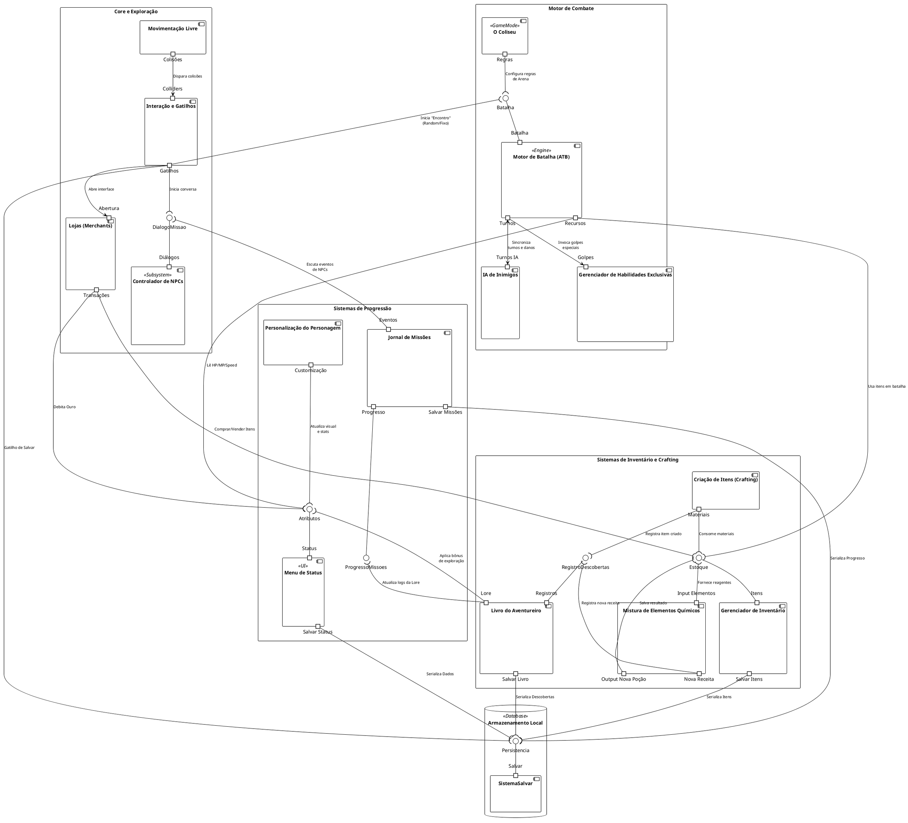
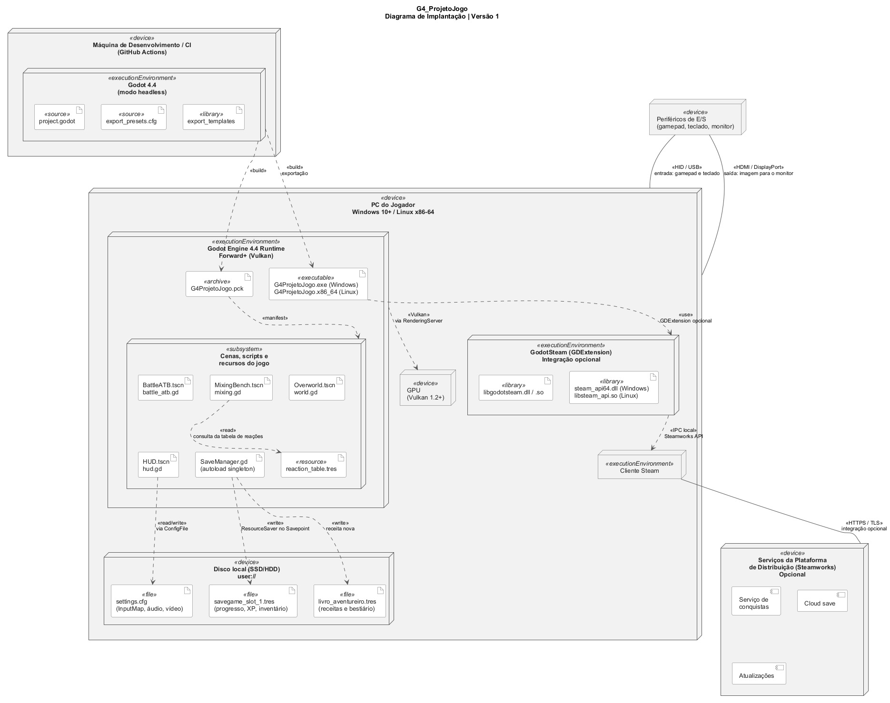

# SubEquipe_02 — Modelagem Estática na Notação UML

## Descrição

Modelagem de processo de negócio da SubEquipe_02, no escopo do **FOCO_01 — Modelagem Estática na Notação UML**. Representa, na notação UML, a modelagem Estática do software.

## Objetivo

Elaborar em UML uma modelagem estática pela subequipe, evidenciando as atividades, os eventos e os pontos de decisão do processo.

## Metodologia

A modelagem estática é definida como um conjunto de atividades sistemáticas para realizar uma tarefa, fornecendo os passos a serem tomados nos diversos estágios do desenvolvimento de software. No presente projeto, a modelagem tem como objetivo elucidar os objetos atuantes no jogo. Para a representação dos diagramas, foi utilizada a plataforma [Draw.io](https://app.diagrams.net/).

Para o Diagrama de Componentes, optou-se pelo **PlantUML** em sua versão de [editor online](https://www.plantuml.com/plantuml/uml/), ferramenta na qual o diagrama é descrito textualmente por meio de uma linguagem de marcação e renderizado automaticamente. A principal vantagem dessa abordagem é o versionamento do diagrama como código-fonte, permitindo que alterações sejam rastreadas no repositório da mesma forma que o código do jogo.

Em contrapartida, a maior dificuldade encontrada com essa ferramenta foi organizar as setas e a localização dos componentes, pois não há como arrastar e colocar os componentes no local certo com o mouse, apenas modificando o código. O posicionamento é determinado pelo algoritmo de layout da ferramenta, de modo que ajustes de disposição precisaram ser feitos indiretamente, por meio da ordem das declarações, da direção explícita das ligações (`-down-`, `-up-`, `-right-`) e de arestas invisíveis (`-[hidden]-`) usadas apenas para forçar o alinhamento desejado entre os pacotes.

Para contornar essa limitação, o código do PlantUML foi importado no [Draw.io](https://app.diagrams.net/), que reconstrói o diagrama como um conjunto de formas editáveis. A partir dessa importação, a disposição dos componentes e o traçado das setas puderam ser ajustados diretamente com o mouse, originando a **versão 1.1** do diagrama. Essa versão preserva integralmente a estrutura e as relações descritas no código-fonte, alterando apenas o aspecto visual e a organização espacial dos elementos.

## Conteúdo

### Diagrama de Classe

Segundo a IBM, os diagramas de classe são fundamentais para o processo de modelagem de objetos, pois modelam a estrutura estática de um sistema. Dependendo da complexidade do projeto, é possível utilizar um único diagrama de classe para representar o sistema inteiro ou múltiplos diagramas para especificar componentes individuais.

Figura 1: Modelo Estático na notação UML. Fonte: Elaboração própria (COSTA, João Igor; FARIAS, João Victor, 2026).

Estes diagramas funcionam como representações abstratas da estrutura do sistema ou subsistema e são utilizados para:

* **Modelar os objetos** que compõem o sistema e suas respectivas responsabilidades;
* **Exibir os relacionamentos** entre os objetos (associação, herança, composição, dependência);
* **Descrever as operações** e serviços fornecidos por meio de seus métodos;
* **Especificar os atributos** e propriedades que caracterizam cada objeto;
* **Estabelecer as restrições** e regras de negócio do domínio.

---

#### Elementos Essenciais do Diagrama de Classe

| Elemento | Descrição | Exemplo |
| :--- | :--- | :--- |
| **Classes** | Estruturas representadas por retângulos divididos em três seções (nome, atributos e operações). | `Jogador`, `Inimigo` |
| **Atributos** | Características que definem o estado de um objeto. | `vida`, `nome`, `posição` |
| **Métodos / Operações** | Comportamentos e funcionalidades executadas pela classe. | `atacar()`, `coletar()`, `validar()` |
| **Relacionamentos** | Conexões que indicam como as classes interagem entre si. | Associação, Herança, Composição, Agregação |

---

### Diagrama de Componentes

O diagrama de componentes é um diagrama estrutural da UML que exibe a organização e as dependências entre um conjunto de componentes. Conforme Booch, Rumbaugh e Jacobson (2005), um componente é uma parte física e substituível de um sistema, que empacota uma implementação e expõe um conjunto de interfaces, de modo que ele possa ser substituído por outro que respeite as mesmas interfaces sem impacto sobre os demais elementos.

Enquanto o diagrama de classe descreve a estrutura lógica do sistema, o diagrama de componentes atua em um nível de abstração mais alto e é utilizado para:

* **Delimitar os subsistemas** do jogo e agrupar funcionalidades correlatas em pacotes coesos;
* **Explicitar as interfaces** fornecidas e requeridas por cada componente;
* **Evidenciar as dependências** entre os módulos, revelando pontos de acoplamento;
* **Apoiar a divisão do trabalho** de implementação entre os integrantes da equipe;
* **Documentar a arquitetura** de forma independente das classes concretas que a realizam.

#### Elementos Essenciais do Diagrama de Componentes

| Elemento | Descrição | Exemplo no diagrama |
| :--- | :--- | :--- |
| **Componente** | Unidade modular e substituível do sistema, representada por um retângulo com o ícone de componente. | `Motor de Batalha (ATB)`, `Gerenciador de Inventário` |
| **Interface Fornecida** | Serviço disponibilizado por um componente, representado pelo símbolo de "pirulito" (*lollipop*). | `Estoque`, `Persistencia` |
| **Interface Requerida** | Serviço consumido por um componente, representado pelo símbolo de "soquete" (*socket*). | `pCra_Materiais -( Estoque` |
| **Porta** | Ponto de interação explícito entre o componente e o seu ambiente. | `portin "Itens"`, `portout "Salvar Itens"` |
| **Pacote** | Agrupamento lógico de componentes relacionados a um mesmo domínio. | `Motor de Combate`, `Sistemas de Progressão` |
| **Dependência** | Relação que indica que um componente necessita de outro para operar. | `Lojas -( Estoque : Comprar/Vender Itens` |

O diagrama elaborado organiza o jogo em cinco agrupamentos: **Core e Exploração**, **Motor de Combate**, **Sistemas de Progressão**, **Sistemas de Inventário e Crafting** e o nó de **Armazenamento Local**. A interface `Persistencia`, exposta pelo componente `SistemaSalvar`, concentra a serialização de status, itens, descobertas e progresso das missões, evitando que cada subsistema implemente a sua própria rotina de salvamento.

#### Imagens

A **versão 1.0** corresponde à renderização direta do código-fonte pelo editor online do PlantUML:

Figura 2: Diagrama de Componentes na notação UML (versão 1.0, gerada no PlantUML). Fonte: Elaboração própria (SILVA, Marcos Vinícius Gündel da, 2026).

A **versão 1.1**, apresentada a seguir, é o resultado da importação desse mesmo código no Draw.io, com reorganização manual dos componentes e das setas, porém sem a presença de portas, pois o Draw.io não suporta nativamente esse elemento. Por manter a mesma semântica da versão anterior e oferecer melhor legibilidade, é a versão vigente do diagrama:

Figura 3: Diagrama de Componentes na notação UML (versão 1.1, refinada no Draw.io). Fonte: Elaboração própria (SILVA, Marcos Vinícius Gündel da, 2026).

#### Código-Fonte do Diagrama de Componentes

Abaixo encontra-se o código em linguagem PlantUML utilizado para gerar a imagem da Figura 2 e que serviu de base para a Figura 3. Para reproduzi-lo, basta colar o conteúdo no [editor online do PlantUML](https://www.plantuml.com/plantuml/uml/); para obter a versão editável, basta importar esse mesmo código no Draw.io.

Clique para expandir o código-fonte (PlantUML)

Código 1: Código-fonte em PlantUML do Diagrama de Componentes. Fonte: Elaboração própria (SILVA, Marcos Vinícius Gündel da, 2026).

---

### Diagrama de Implantação

O Diagrama de Implantação é o diagrama estrutural da UML que mostra a distribuição de artefatos sobre nós e os caminhos de comunicação entre eles (OBJECT MANAGEMENT GROUP, 2017). Três conceitos sustentam a leitura do modelo:

- **Nó `<<device>>`:** recurso computacional físico, como o PC do jogador, a GPU ou o armazenamento local.
- **Nó `<<executionEnvironment>>`:** ambiente de software implantado dentro de um dispositivo e que hospeda a execução de artefatos, como o runtime do Godot.
- **Artefato:** item concreto e manifesto da solução, como executável, pacote, script, arquivo de dados ou de configuração.

O diagrama usa dois tipos de linha, com significados diferentes. As **linhas contínuas** são caminhos de comunicação entre nós (por exemplo, periféricos ligados ao PC por USB e HDMI). As **linhas tracejadas** são dependências, qualificadas por estereótipo: `<<build>>` para o que é gerado na exportação, `<<manifest>>` para indicar que o pacote `.pck` materializa as cenas e scripts do jogo, `<<read>>`, `<<write>>` e `<<read/write>>` para acesso a arquivos, `<<use>>` para carregamento de biblioteca, `<<IPC local>>` para a comunicação entre processos na mesma máquina e `<<Vulkan>>` para a chamada gráfica. Sempre que possível, as dependências ligam artefatos, e não nós inteiros, o que deixa claro **qual** script lê ou grava **qual** arquivo.

#### Decisões e premissas de implantação

1. **Motor de jogo:** Godot Engine 4.4, com renderizador Forward+ sobre Vulkan (decisão da equipe).
2. **Plataforma-alvo:** desktop, Windows 10+ e Linux x86-64, conforme a opção "versão desktop" da definição do projeto.
3. **Implantação monolítica e *offline-first*:** não há servidor de jogo. Todo o ciclo Explorar → Coletar → Misturar → Combater executa no PC do jogador.
4. **Integração com loja opcional:** conquistas, *cloud save* e atualizações passam pela GDExtension GodotSteam, que depende do cliente Steam em execução no mesmo PC; na ausência dele, o jogo continua funcional.
5. **Build automatizado:** a exportação do projeto é feita pelo Godot em modo *headless*, sem interface gráfica, em uma máquina de desenvolvimento ou em integração contínua (GitHub Actions), gerando os binários para Windows e Linux.

---

#### Diagrama

O diagrama pode ser lido de cima para baixo em quatro partes: **produção** (máquina de CI com o Godot em modo *headless*, que exporta o executável e o pacote do jogo), **execução** (PC do jogador com o runtime do Godot e o subsistema de cenas e scripts), **persistência e hardware** (disco local com `user://` e GPU) e **integração opcional** (GodotSteam, cliente Steam e serviços da Steamworks).

Figura 4: Diagrama de Implantação do G4_ProjetoJogo na notação UML. Fonte: Elaboração própria (LOPES, Marcelo de Araújo, 2026).

---

#### Nós e artefatos implantados

| Nó | Estereótipo | Artefatos implantados | Papel na solução |
|----|-------------|-----------------------|------------------|
| Máquina de Desenvolvimento / CI (GitHub Actions) | `<<device>>` | Nenhum | Máquina onde o projeto é exportado. |
| Godot 4.4 (modo *headless*) | `<<executionEnvironment>>` | `project.godot` e `export_presets.cfg` (`<<source>>`), `export_templates` (`<<library>>`) | Executa a exportação que gera os artefatos distribuídos. |
| Periféricos de E/S | `<<device>>` | Nenhum | Gamepad e teclado como entrada; monitor como saída. |
| PC do Jogador (Windows 10+ / Linux x86-64) | `<<device>>` | Nenhum | Máquina do usuário final, que hospeda todos os ambientes de execução do jogo. |
| Godot Engine 4.4 Runtime (Forward+ / Vulkan) | `<<executionEnvironment>>` | `G4ProjetoJogo.exe` no Windows ou `G4ProjetoJogo.x86_64` no Linux (`<<executable>>`), `G4ProjetoJogo.pck` (`<<archive>>`) | Executa o laço principal do jogo a partir do binário e do pacote exportados. |
| Cenas, scripts e recursos do jogo | `<<subsystem>>` | `BattleATB.tscn` + `battle_atb.gd`, `MixingBench.tscn` + `mixing.gd`, `Overworld.tscn` + `world.gd`, `HUD.tscn` + `hud.gd`, `SaveManager.gd` (*autoload singleton*), `reaction_table.tres` (`<<resource>>`) | Conteúdo do jogo empacotado no `.pck`: combate, mistura, mundo, interface e persistência. |
| Disco local (SSD/HDD), caminho `user://` | `<<device>>` | `savegame_slot_1.tres`, `livro_aventureiro.tres`, `settings.cfg` (`<<file>>`) | Estado persistente entre sessões: progresso, receitas descobertas e preferências. |
| GPU (Vulkan 1.2+) | `<<device>>` | Nenhum | Destino dos comandos de desenho do renderizador Forward+. |
| GodotSteam (GDExtension) | `<<executionEnvironment>>` | `libgodotsteam.dll / .so`, `steam_api64.dll` no Windows ou `libsteam_api.so` no Linux (`<<library>>`) | Ponte opcional entre o jogo e a Steam. |
| Cliente Steam | `<<executionEnvironment>>` | Nenhum | Processo local exigido pela Steamworks API; é ele que se comunica com os servidores da Steam. |
| Serviços da Plataforma de Distribuição (Steamworks) | `<<device>>` | componentes Serviço de conquistas, Cloud save e Atualizações | Infraestrutura externa, representada como caixa-preta. |

Tabela 1: Nós, estereótipos e artefatos do Diagrama de Implantação. Fonte: Elaboração própria (LOPES, Marcelo de Araújo, 2026).

#### Caminhos de comunicação e dependências

| Origem | Destino | Tipo e estereótipo | Significado |
|--------|---------|--------------------|-------------|
| Godot 4.4 (modo *headless*) | `G4ProjetoJogo.exe` / `.x86_64` | dependência `<<build>>` | A exportação gera o executável de cada plataforma. |
| Godot 4.4 (modo *headless*) | `G4ProjetoJogo.pck` | dependência `<<build>>` | A exportação gera o pacote com o conteúdo do jogo. |
| `G4ProjetoJogo.pck` | Cenas, scripts e recursos do jogo | dependência `<<manifest>>` | O pacote materializa as cenas, scripts e recursos carregados pelo runtime. |
| Periféricos de E/S | PC do Jogador | caminho de comunicação `<<HID / USB>>` | Entrada do gamepad e do teclado. |
| Periféricos de E/S | PC do Jogador | caminho de comunicação `<<HDMI / DisplayPort>>` | Saída de imagem para o monitor. |
| `SaveManager.gd` | `savegame_slot_1.tres` | dependência `<<write>>` | Gravação do progresso via `ResourceSaver` ao usar um Savepoint. |
| `SaveManager.gd` | `livro_aventureiro.tres` | dependência `<<write>>` | Registro de receita nova no Livro do Aventureiro. |
| `HUD.tscn` + `hud.gd` | `settings.cfg` | dependência `<<read/write>>` | Leitura e gravação do `InputMap` e das preferências via `ConfigFile`, inclusive quando o jogador remapeia os botões. |
| `MixingBench.tscn` + `mixing.gd` | `reaction_table.tres` | dependência `<<read>>` | Consulta à tabela de reações durante a mistura. |
| Godot Engine 4.4 Runtime | GPU | dependência `<<Vulkan>>` | Desenho do mundo, das batalhas e da interface via `RenderingServer`. |
| `G4ProjetoJogo.exe` | GodotSteam | dependência `<<use>>` | Carregamento opcional da GDExtension. |
| GodotSteam | Cliente Steam | dependência `<<IPC local>>` | Chamadas à Steamworks API atendidas pelo cliente Steam em execução no PC. |
| Cliente Steam | Steamworks | caminho de comunicação `<<HTTPS / TLS>>` | Conquistas, *cloud save* e atualizações, apenas quando há integração. |

Tabela 2: Caminhos de comunicação e dependências do Diagrama de Implantação. Fonte: Elaboração própria (LOPES, Marcelo de Araújo, 2026).

#### Rastreabilidade com os artefatos da Entrega 01

| Elemento do diagrama | Evidência de origem (SubEquipe_02, Entrega 01) |
|----------------------|------------------------------------------------|
| `savegame_slot_1.tres` e `SaveManager.gd` | Léxico L27: o Savepoint "registra o estado atual da partida" e é o "ponto de retorno após um Game Over"; frame 3 do BPMN (gravação e recarga do Savepoint). |
| `livro_aventureiro.tres` | Léxico L25: o Livro do Aventureiro "é atualizado conforme o Jogador descobre novas receitas"; frame 2 do BPMN (registro de receita nova). |
| `MixingBench` e `reaction_table.tres` | Léxico L09 e L10; frame 2 do BPMN, com bancada portátil de dois slots com consulta à tabela de reações. |
| `BattleATB` | BPMN do Motor de Batalha: fila de turnos, tarefa *Tick do ATB* e cálculo de dano. |
| `HUD` e `settings.cfg` | SIG do NFR Framework: softgoal Usabilidade/UX, com HUD com todas as informações e Mapeamento de Botões; Léxico L16. |
| `Overworld` | Léxico L12 (Explorar) e L26 (Mundo Semiaberto); SIG, softgoal Jogabilidade Fluida. |
| Ausência de servidor de jogo e de loja | Questionário Q10: rejeição a mecânicas *pay-to-win*; projeto *single-player*. |
| GodotSteam, cliente Steam e Steamworks como opcionais | Questionário Q11: conquistas externas como incentivo de importância moderada. |

Tabela 3: Rastreabilidade entre o Diagrama de Implantação e os artefatos da Entrega 01. Fonte: Elaboração própria (LOPES, Marcelo de Araújo, 2026).

## Referências

CARVALHO, Ariadne Maria Brito Rizzoni. **Engenharia de Software: Capítulo 3**. Instituto de Computação – UNICAMP. Disponível em: <https://www.ic.unicamp.br/~ariadne/mc426/cap03.pdf>. Acesso em: 15 set. 2026.

IBM. **Diagramas de classe**. IBM Documentation, 2021. Disponível em: <https://www.ibm.com/docs/pt-br/rsas/7.5.0?topic=structure-class-diagrams>. Acesso em: 15 set. 2026.

BOOCH, Grady; RUMBAUGH, James; JACOBSON, Ivar. **UML: Guia do Usuário**. 2. ed. Rio de Janeiro: Elsevier, 2005.

GODOT ENGINE. **Exporting projects** e **File paths in Godot projects**. Godot Docs, versão 4.4. Disponível em: <https://docs.godotengine.org/en/stable/tutorials/export/exporting_projects.html>. Acesso em: 16 set. 2026.

GODOTSTEAM. **GodotSteam: Steamworks for Godot Engine**. Disponível em: <https://godotsteam.com>. Acesso em: 16 set. 2026.

OBJECT MANAGEMENT GROUP. **OMG Unified Modeling Language (OMG UML), Version 2.5.1**. OMG, 2017. Disponível em: <https://www.omg.org/spec/UML/2.5.1/>. Acesso em: 16 set. 2026.

## Nível de Contribuição dos Integrantes

| Nome | % de Contribuição |
|------|-------------------|
|João Igor |     25%       |
|Marcos Vinícius Gündel da Silva |     25%       |
|Marcelo de Araújo Lopes |     25%       |
|João Victor da Silva Batista de Farias |     25%       |

Tabela 4: Contribuição dos integrantes. Fonte: Autores, 2026.

## Histórico de Versão

| Versão | Data | Descrição | Autor(es) | Revisor |
|:------:|------|:----------|:----------|:--------|
|  1.0   | 15/09|  Adição da literatura correspondente e do Diagrama de Classe  | [João Igor](https://github.com/JoaoPC10)          |         |
|  1.1   | 16/09|  Adição do Diagrama de Componentes, do seu código-fonte em PlantUML e da referência literária correspondente  | [Marcos Vinícius](https://github.com/MarcosViniciusG)          |         |
|  1.2   | 16/09|  Adição da versão 1.1 do Diagrama de Componentes, refinada no Draw.io a partir da importação do código em PlantUML  | [Marcos Vinícius](https://github.com/MarcosViniciusG)          |         |
|  1.3   |17/09 | Correção da renderização das imagens no GitHub Pages (troca de `` por sintaxe Markdown) e dos links de perfil sem `https://` | [Marcos Vinícius](https://github.com/MarcosViniciusG) |         |
|  1.4   |17/09 | Adição do Diagrama de Implantação, com as tabelas de nós e artefatos, caminhos de comunicação e rastreabilidade | [Marcelo de Araújo Lopes](https://github.com/MatielloAL) |         |
|  1.5   |17/09 | Adição da participação de João Victor (revisão geral e elicitação da lista de requisitos iniciais) | [João Victor](https://github.com/beyondmagic) |         |
|  1.6   |18/09 | Adição de João Victor como co-autor do Diagrama de Classe | [João Victor](https://github.com/beyondmagic) |         |

Tabela 5: Histórico de versão. Fonte: Autores, 2026.

Ver também: [Modelagem Dinâmica na Notação UML](ModelagemDinamica.md) · [IA Generativa](IAGenerativa.md)
