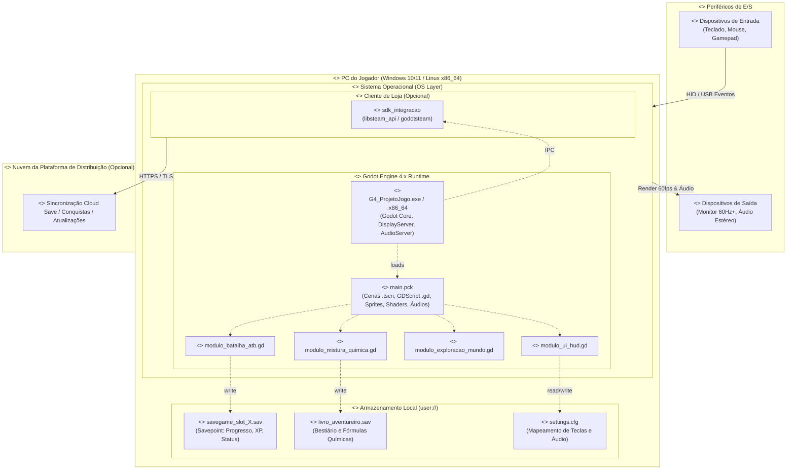

# SubEquipe_02 — Modelagem Estática: Diagrama de Implantação (Versão 2)

## Descrição

Modelagem de processo e arquitetura de software no escopo do **FOCO_01 — Modelagem Estática na Notação UML**. Representa a topologia física e lógica de execução do sistema **G4_ProjetoJogo**.

Esta página apresenta a **Versão 2 do Diagrama de Implantação**, estruturada a partir dos requisitos e modelos concebidos na **Entrega 01**: o [Léxico](https://unbarqdsw2026-2-turma01.github.io/2026.2-T01-G4_ProjetoJogo_Entrega_01/#/Base/Relatórios/SubEquipe_02/Lexico.md), o [Rich Picture](https://unbarqdsw2026-2-turma01.github.io/2026.2-T01-G4_ProjetoJogo_Entrega_01/#/Base/Relatórios/SubEquipe_02/RichPicture.md), o [SIG do NFR Framework](https://unbarqdsw2026-2-turma01.github.io/2026.2-T01-G4_ProjetoJogo_Entrega_01/#/Base/Relatórios/SubEquipe_02/NFRFramework.md), o [BPMN](https://unbarqdsw2026-2-turma01.github.io/2026.2-T01-G4_ProjetoJogo_Entrega_01/#/Base/Relatórios/SubEquipe_02/BPMN.md) e o [Questionário](https://unbarqdsw2026-2-turma01.github.io/2026.2-T01-G4_ProjetoJogo_Entrega_01/#/Base/Relatórios/SubEquipe_02/Questionario.md).

---

## Objetivo

Evidenciar a **arquitetura de implantação e distribuição física** do G4_ProjetoJogo, mapeando:
1. Os nós de hardware (`<<device>>`) e ambientes de execução (`<<executionEnvironment>>`);
2. Os artefatos compilados, empacotados e arquivos de dados persistentes (`<<artifact>>`);
3. Os protocolos e caminhos de comunicação entre hardware, runtime e armazenamento local/remoto;
4. A garantia dos requisitos de arquitetura *offline-first* e *single-player* desktop.

---

## Metodologia e Fundamentação Teórica

O **Diagrama de Implantação** (Deployment Diagram) é o diagrama estrutural da UML 2.5.1 responsável por modelar a arquitetura física sobre a qual o software opera (OBJECT MANAGEMENT GROUP, 2017). 

Nesta versão (v2), adota-se a concretização sobre a arquitetura do **Godot Engine 4 (GDScript)** para plataformas Desktop (Windows 10/11 x64 e Linux x86_64), detalhando como o executável nativo carrega o pacote de recursos compilados (`main.pck`), gerencia o subsistema de entrada/saída através de APIs do Sistema Operacional e persiste o progresso do jogador no diretório de dados do usuário (`user://`).

### Premissas Arquiteturais

1. **Topologia Monolítica e *Offline-First*:** Todo o fluxo principal de jogo (Exploração, Batalha ATB por turnos, Bancada de Mistura de Elementos Químicos e Gerenciamento de Inventário) roda 100% localmente no hardware do usuário final, sem dependência de conexão de rede ou servidores dedicados de partida.
2. **Ambiente de Execução Godot Engine 4.x:** O binário nativo (`G4_ProjetoJogo.exe` / `.x86_64`) carrega dinamicamente o pacote de dados do jogo (`main.pck`), delegando tarefas aos módulos específicos desenvolvidos em GDScript.
3. **Persistência de Dados Isolada (`user://`):** O salvamento do jogo (*Savepoint*), o registro contínuo de fórmulas (*Livro do Aventureiro*) e as preferências do jogador (*settings.cfg*) são persistidos no armazenamento local com formatos leves e serializáveis (JSON / ConfigFile / Resource).
4. **Serviços de Plataforma Digitais Desacoplados:** A integração com plataformas como Steam ou Epic Games ocorre de forma opcional via biblioteca/SDK local (`sdk_integracao`), não impedindo o funcionamento do jogo caso o jogador esteja desconectado ou execute uma versão DRM-free.

---

## Diagrama de Implantação

### Visualização Gráfica (Mermaid)

Figura 1: Diagrama de Implantação do G4_ProjetoJogo — Versão 2. Fonte: [Nome do Autor] (2026).

---

### Código-Fonte PlantUML

O código-fonte correspondente está salvo em [`assets/diagrama-de-implantacao-v2.puml`](assets/diagrama-de-implantacao-v2.puml).

---

## Detalhamento dos Elementos do Diagrama

### 1. Nós e Artefatos Implantados

| Nó | Estereótipo | Artefatos Implantados | Papel e Responsabilidade |
|---|---|---|---|
| **Periféricos de Entrada/Saída** | `<<device>>` | — | Dispositivos de hardware físico (teclado, mouse, gamepad DirectInput/XInput, monitor e caixas de som). |
| **PC do Jogador** | `<<device>>` | — | Hardware da máquina cliente (Desktop x86_64, Windows ou Linux). |
| **Sistema Operacional** | `<<executionEnvironment>>` | Win32 / POSIX APIs, Drivers de Vídeo/Áudio | Mediação entre o hardware e o runtime do jogo. |
| **Godot Engine 4.x Runtime** | `<<executionEnvironment>>` | `G4_ProjetoJogo.exe`, `main.pck`, `modulo_batalha_atb.gd`, `modulo_mistura_quimica.gd`, `modulo_exploracao_mundo.gd`, `modulo_ui_hud.gd` | Laço principal do jogo (Main Loop), processamento de física/lógica 2D, renderização e processamento dos turnos e inventário. |
| **Armazenamento Local (`user://`)** | `<<device>>` | `savegame_slot_X.sav`, `livro_aventureiro.sav`, `settings.cfg` | Diretório protegido do sistema de arquivos local para persistência de progresso, estado do jogo e configurações. |
| **Cliente da Loja (Opcional)** | `<<executionEnvironment>>` | `sdk_integracao` (DLL/.so) | Intermediação de *overlay*, conquistas externas e sincronização de arquivos em nuvem. |
| **Nuvem da Plataforma de Distribuição** | `<<device>>` | Serviços de Cloud Save, Conquistas e Atualização | Servidores remotos de suporte comercial e distribuição da loja digital. |

Tabela 1: Nós, estereótipos e artefatos implantados. Fonte: [Nome do Autor] (2026).

---

### 2. Caminhos de Comunicação e Protocolos

| Origem | Destino | Protocolo / Estereótipo | Descrição do Fluxo |
|---|---|---|---|
| Periféricos de Entrada | Sistema Operacional | `<<USB / Bluetooth HID>>` | Captura de eventos brutos de teclado, mouse e botões de gamepad. |
| Sistema Operacional | Periféricos de Saída | `<<DirectX / Vulkan / ALSA>>` | Envio de buffer de vídeo renderizado (60 FPS) e streaming de áudio. |
| Sistema Operacional | Executável Godot | `<<OS Event Loop>>` | Despacho de `InputEvent` tratados para a árvore de nós do Godot. |
| `modulo_batalha_atb.gd` | `savegame_slot_X.sav` | `<<write / serialize>>` | Persistência do estado do time, HP, MP, inventário e XP ao interagir com o Savepoint ou finalizar batalha. |
| `modulo_mistura_quimica.gd` | `livro_aventureiro.sav` | `<<write / update>>` | Registro permanente de novas combinações e receitas químicas descobertas pelo jogador. |
| `modulo_ui_hud.gd` | `settings.cfg` | `<<read / write>>` | Carregamento inicial e gravação de preferências de áudio, vídeo e remapeamento de comandos. |
| Executável Godot | SDK da Plataforma | `<<IPC / GDExtension>>` | Notificação local de conquistas desbloqueadas durante a sessão de jogo. |
| Cliente da Loja | Servidores em Nuvem | `<<HTTPS / TLS 1.3>>` | Sincronização do save e conquistas com a nuvem (quando online). |

Tabela 2: Caminhos de comunicação e protocolos. Fonte: [Nome do Autor] (2026).

---

### 3. Rastreabilidade com os Artefatos da Entrega 01

| Elemento no Diagrama de Implantação | Artefato de Origem (Entrega 01) | Rastreabilidade e Justificativa |
|---|---|---|
| `savegame_slot_X.sav` | **Léxico (L27 - Savepoint)** & **BPMN (Frame 3)** | O Léxico define o Savepoint como ponto de recuperação e persistência; o BPMN modela o encerramento do combate e gravação em disco. |
| `livro_aventureiro.sav` | **Léxico (L25 - Livro do Aventureiro)** & **BPMN (Frame 2)** | Representa o diário de bordo com as receitas desbloqueadas na bancada de 2 slots modelada no BPMN. |
| `modulo_mistura_quimica.gd` | **BPMN (Subprocesso de Mistura)** & **Léxico (L09, L10, L22)** | Implementa a lógica da bancada de 2 slots e consulta à matriz de reações de elementos químicos. |
| `modulo_batalha_atb.gd` | **BPMN (Motor de Batalha ATB)** & **Léxico (L15, L16)** | Implementa o laço do Active Time Battle, fila de turnos e cálculo de dano/fraquezas. |
| `modulo_ui_hud.gd` e `settings.cfg` | **NFR Framework (SIG - Usabilidade/UX)** | Atende aos requisitos de HUD com informações vitais, minimapa dinâmico, feedback visual de dano e remapeamento de botões. |
| `modulo_exploracao_mundo.gd` | **NFR Framework (SIG - Jogabilidade)** & **Léxico (L26)** | Suporta a navegação fluida em mundo semiaberto e geração de encontros. |
| Ausência de servidor de gameplay | **Questionário (Q10)** & **Rich Picture** | Rejeição unânime a mecânicas *pay-to-win* e definição do jogo como RPG *single-player* puramente offline. |
| Serviços de Plataforma Opcionais | **Questionário (Q11)** | Integração com conquistas e nuvem tratada como serviço opcional não-bloqueante. |

Tabela 3: Matriz de rastreabilidade com a Entrega 01. Fonte: [Nome do Autor] (2026).

---

## Referências Bibliográficas

- OBJECT MANAGEMENT GROUP (OMG). **Unified Modeling Language (OMG UML), Version 2.5.1**. 2017. Disponível em: <https://www.omg.org/spec/UML/2.5.1/PDF>. Acesso em: 15 set. 2026.
- PLANTUML. **PlantUML Language Reference Guide — Deployment Diagram**. Versão 1.2025.4, 2025. Disponível em: <https://plantuml.com/deployment-diagram>. Acesso em: 15 set. 2026.
- GODOT ENGINE DOCUMENTATION. **Exporting Projects & File Paths in Godot Projects (`user://` vs `res://`)**. Godot Engine Documentation, 2026. Disponível em: <https://docs.godotengine.org/>. Acesso em: 15 set. 2026.
- UNB FCTE — ARQDSW. **Módulo de Modelagem**. Disponível em: <https://sites.google.com/view/unb-fcte-arqdsw/módulos/módulo-modelagem>. Acesso em: 15 set. 2026.

---

## Nível de Contribuição dos Integrantes

| Nome | % de Contribuição |
|---|---|
| [Nome do Autor] | 100% |

Tabela 4: Contribuição dos integrantes.

---

## Histórico de Versão

| Versão | Data | Descrição | Autor(es) | Revisor |
|:---:|:---:|:---|:---|:---|
| 2.0 | 15/09/2026 | Elaboração da Versão 2 do Diagrama de Implantação com runtime Godot 4, persistência user:// e rastreabilidade com a Entrega 01 | [Nome do Autor] | |

Tabela 5: Histórico de versão.

Ver também: [Versão 1 da Modelagem Estática](ModelagemEstatica.md) · [Modelagem Dinâmica](ModelagemDinamica.md) · [IA Generativa](IAGenerativa.md)
