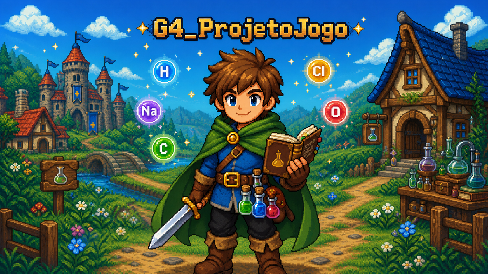

# G4_ProjetoJogo

<p align="center">
  
</p>

<p align="center">Figura 1: Identidade visual do G4_ProjetoJogo. Fonte: imagem gerada pelo GPT-5.6 Sol Alto (IA), 2026.</p>

**Código da Disciplina:** FGA0208: Arquitetura e Desenho de Software<br>
**Turma:** 01 · **Período:** 2026.2<br>
**Número do Grupo:** 04<br>
**Entrega:** 02

## Sobre

O **G4_ProjetoJogo** é um **RPG medieval 2D de mundo semiaberto**, com história linear e combate por turnos (referências: Final Fantasy clássicos e Undertale). Sua mecânica distintiva é a **mistura de elementos químicos** da tabela periódica: fora do combate, o jogador combina elementos coletados no mundo para criar itens, registrando as receitas descobertas no Livro do Aventureiro.

A identidade visual combina a estética de um RPG em pixel art com o aventureiro, o Livro do Aventureiro, os frascos e os símbolos de elementos químicos, representando a relação entre exploração, alquimia, criação de itens e combate.

Como convenção visual da documentação, a SubEquipe 01 é identificada por H, a SubEquipe 02 por C e a SubEquipe 03 por O. Os símbolos funcionam apenas como temas gráficos e não representam a divisão técnica das responsabilidades. Nas páginas gerais, Fe representa a ambientação medieval e a presença dos elementos químicos no jogo.

Detalhes completos em [Projeto](/Projeto/Projeto.md).

## Equipe

O grupo é formado por 10 integrantes, organizados em 3 subgrupos. A divisão foi feita por livre escolha dos integrantes.

| Matrícula | Aluno | Subgrupo |
|-----------|-------|:--------:|
| 23/2014404 | Carlos Henrique Brasil de Souza | 03 |
| 23/1026680 | Cibelly Lourenço Ferreira | 01 |
| 23/2013980 | Gabriel Andrade Magioli | 01 |
| 23/1027201 | João Igor Pereira da Costa | 02 |
| 22/1022604 | João Victor da Silva Batista de Farias | 02 |
| 21/1062179 | Marcelo de Araújo Lopes | 02 |
| 23/2014100 | Marcos Vinícius Gündel da Silva | 02 |
| 23/2014146 | Pedro Teixeira Moriel Sanchez | 03 |
| 22/2037764 | Renan Pereira Reis | 03 |
| 23/2014576 | Yogi Nam de Souza Barbosa | 01 |

<p align="center">Tabela 1: Integrantes do Grupo 04.</p>

## Subgrupos

Cada subgrupo é responsável por seu próprio relatório, contendo a entrega mínima: um Modelo Estático na notação UML, um Modelo Dinâmico na notação UML e os pontos de vista dos membros sobre o uso de IA Generativa.

### Subgrupo 01

| Aluno | Matrícula |
|-------|-----------|
| Cibelly Lourenço Ferreira | 23/1026680 |
| Gabriel Andrade Magioli | 23/2013980 |
| Yogi Nam de Souza Barbosa | 23/2014576 |

<p align="center">Tabela 2: Integrantes do Subgrupo 01.</p>

Artefatos: [Diagrama de Componentes](/Base/Relatórios/SubEquipe_01/DiagramaComponentes.md) · [Diagrama de Pacotes](/Base/Relatórios/SubEquipe_01/DiagramaPacotes.md) · [Diagrama de Classes](/Base/Relatórios/SubEquipe_01/DiagramaClasses.md) · [Diagrama de Atividades](/Base/Relatórios/SubEquipe_01/DiagramaAtividades.md) · [Diagrama de Estados](/Base/Relatórios/SubEquipe_01/DiagramaEstados.md) · [Diagrama de Sequências](/Base/Relatórios/SubEquipe_01/DiagramaSequencias.md) · [IA Generativa](/Base/Relatórios/SubEquipe_01/IAGenerativa.md)

### Subgrupo 02

| Aluno | Matrícula |
|-------|-----------|
| João Igor Pereira da Costa | 23/1027201 |
| João Victor da Silva Batista de Farias | 22/1022604 |
| Marcelo de Araújo Lopes | 21/1062179 |
| Marcos Vinícius Gündel da Silva | 23/2014100 |

<p align="center">Tabela 3: Integrantes do Subgrupo 02.</p>

Artefatos: [Modelagem Estática na Notação UML](/Base/Relatórios/SubEquipe_02/ModelagemEstatica.md) · [Modelagem Dinâmica na Notação UML](/Base/Relatórios/SubEquipe_02/ModelagemDinamica.md) · [IA Generativa](/Base/Relatórios/SubEquipe_02/IAGenerativa.md) · [Iniciativas Extras](/Base/Relatórios/SubEquipe_02/IniciativasExtras.md)

### Subgrupo 03

| Aluno | Matrícula |
|-------|-----------|
| Carlos Henrique Brasil de Souza | 23/2014404 |
| Pedro Teixeira Moriel Sanchez | 23/2014146 |
| Renan Pereira Reis | 22/2037764 |

<p align="center">Tabela 4: Integrantes do Subgrupo 03.</p>

Artefatos: [Modelagem Estática na Notação UML](/Base/Relatórios/SubEquipe_03/ModelagemEstatica.md) · [Modelagem Dinâmica na Notação UML](/Base/Relatórios/SubEquipe_03/ModelagemDinamica.md) · [IA Generativa](/Base/Relatórios/SubEquipe_03/IAGenerativa.md)

## Navegação

| Seção | Conteúdo |
|-------|----------|
| [Projeto](/Projeto/Projeto.md) | Visão geral do jogo, ênfases e contexto da disciplina. |
| [Modelagem](/Base/1.Modelagem.md) | Módulo Desenho de Software: Design Sprint, relatórios das subequipes, participações e iniciativas extras. |
| [Atas de Reunião](/Atas/Gerais.md) | Registro oficial das reuniões, separado em gerais e por subgrupo. |
| [Guias](/Guias/ArtefatoPadrao.md) | Modelos padrão de artefato e de ata adotados pelo grupo. |
| [Participações](/Base/1.2.ParticipacoesModelagem.md) | Quadro geral de participação com links de commits por integrante. |

<p align="center">Tabela 5: Navegação da documentação.</p>

A barra lateral oferece pesquisa textual em todas as páginas da documentação.

O rodapé **Ver também** acompanha a organização da barra lateral. Clique nas imagens para ampliá-las na própria página; use os botões de zoom, a roda do mouse ou a pinça no celular e arraste para mover a imagem.

## Informações Complementares

A documentação é publicada com [Docsify](https://docsify.js.org/) a partir da pasta `docs/`. Para executá-la localmente:

```bash
npx docsify-cli serve docs
```

O site fica disponível em `http://localhost:3000`.

## Vídeo da Apresentação

Apresentação da Entrega 02, com os artefatos produzidos pelas três subequipes, o quadro de participações e os comentários sobre o trabalho em equipe.

<div style="max-width:720px;margin:0 auto;">
  <div style="position:relative;width:100%;padding-top:56.25%;">
    <iframe style="position:absolute;top:0;left:0;width:100%;height:100%;border:0;" src="https://www.youtube.com/embed/EAKD7sSNUJQ" title="Apresentação da Entrega 02 — G4_ProjetoJogo" allow="accelerometer; autoplay; clipboard-write; encrypted-media; gyroscope; picture-in-picture; web-share" referrerpolicy="strict-origin-when-cross-origin" allowfullscreen></iframe>
  </div>
</div>

<p align="center">Vídeo 1: Apresentação da Entrega 02. Fonte: Autores, 2026.</p>

Caso o vídeo não carregue, acesse-o diretamente em <https://youtu.be/EAKD7sSNUJQ>.
